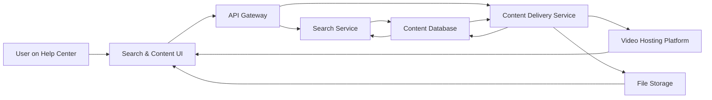

#### 1. High-Level Design

- **Summary:** Enable users to access, view, and search multiple help content types (text articles, FAQs, video tutorials, downloadable materials) with keyword search returning results within 2 seconds. Videos must play within 3 seconds, downloads begin within 2 seconds, all served over HTTPS, supporting 100,000 concurrent users with 99.9% uptime and responsive design across devices.

- **Component Flow:**

- **Integration Points:**
  - **Upstream:** Help Center landing page and navigation (provides search entry point and category filters)
  - **Downstream:** Video hosting platform (for embedded tutorial playback), secure file storage system (for downloadable PDFs/guides), content database/CMS (for articles and FAQs), existing website infrastructure (for authentication and CDN)

- **Key Assumptions:**
  - Search service uses full-text indexing (e.g., Elasticsearch, Solr) with content indexed by type, category, and keywords for sub-2-second query response.
  - Video hosting platform provides embeddable player with accessibility controls; downloadable files are stored in cloud object storage (e.g., S3) with CDN for fast delivery.

- **NFR Highlights:** Content loads in 2 seconds (broadband) / 4 seconds (mobile); video plays within 3 seconds; downloads begin within 2 seconds; supports 100,000 concurrent users; HTTPS-only; 99.9% uptime.

- **Data Flow:**
  1. User enters search keywords or selects content category on Help Center UI
  2. Search & Content UI sends request to API Gateway
  3. API Gateway routes to Search Service for keyword queries or Content Delivery Service for category browsing
  4. Search Service queries Content Database using indexed keywords and returns ranked results (articles, FAQs, videos, files)
  5. Content Delivery Service retrieves content metadata and URLs from Content Database
  6. For videos: Content Delivery Service returns embedded player URL from Video Hosting Platform
  7. For downloads: Content Delivery Service returns secure signed URL from File Storage
  8. Results are returned to UI and displayed to user
  9. User clicks video to play (loaded from Video Hosting Platform) or download link (served from File Storage via HTTPS)
  10. Error handling provides fallback messages when resources are unavailable

#### 2. Validation Report

- **Requirements Coverage:** The design covers all requirements: text articles, FAQs, video tutorials, downloadable materials, keyword search with 2-second response, video playback within 3 seconds, downloads within 2 seconds, HTTPS delivery, 100,000 concurrent users, 99.9% uptime, responsive design, and error handling. The architecture separates search, content delivery, video hosting, and file storage for independent scaling and resilience.