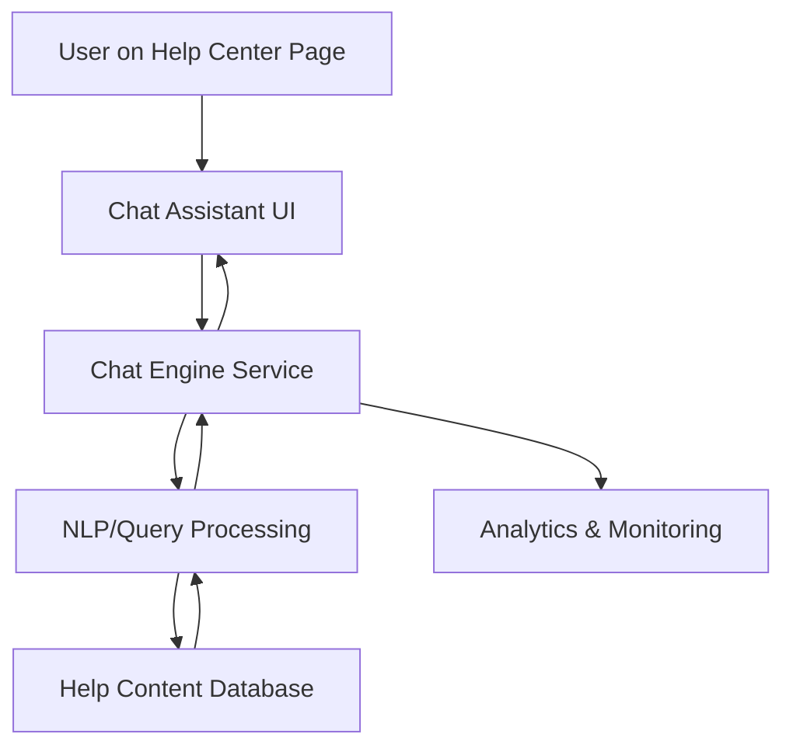

#### 1. High-Level Design

- **Summary:** Deliver an interactive chat assistant accessible from the Help Center landing page that provides real-time automated support, handles up to 10,000 simultaneous sessions, responds to queries within 2 seconds, and links users to relevant help articles. The solution must be secure (HTTPS), accessible (WCAG 2.1 AA), and include monitoring capabilities for support staff.

- **Component Flow:**

- **Integration Points:**
  - **Upstream:** Help Center landing page (provides entry point and context)
  - **Downstream:** Help content database (for retrieving relevant articles and materials), analytics system (for interaction monitoring), chat assistant technology platform (third-party or internal NLP/chatbot engine)

- **Key Assumptions:**
  - Chat assistant uses a pre-trained NLP model or rule-based engine with predefined intents mapped to help content; knowledge base is indexed and searchable via API.
  - Chat session state is maintained in-memory or via distributed cache for scalability across 10,000 concurrent sessions.

- **NFR Highlights:** Chat window opens within 2 seconds; supports 10,000 simultaneous sessions; HTTPS-only; WCAG 2.1 AA compliant; 99.9% uptime.

- **Data Flow:**
  1. User clicks chat assistant icon on Help Center page
  2. Chat UI loads and establishes secure WebSocket or HTTPS connection to Chat Engine Service
  3. User enters query text
  4. Chat Engine forwards query to NLP/Query Processing module
  5. NLP module analyzes query, extracts intent/keywords, and queries Help Content Database
  6. Relevant articles/links are returned to NLP module
  7. NLP module formats response with links and sends back to Chat Engine
  8. Chat Engine delivers response to Chat UI for display to user
  9. All interactions are logged to Analytics & Monitoring system for support staff review

#### 2. Validation Report

- **Requirements Coverage:** The design addresses all stated requirements: interactive chat interface, automated response system, 10,000 concurrent sessions, 2-second response time, HTTPS security, WCAG 2.1 AA accessibility, links to help articles, and interaction monitoring. The component flow shows clear separation between UI, chat engine, NLP processing, content retrieval, and analytics, enabling independent scaling and monitoring.