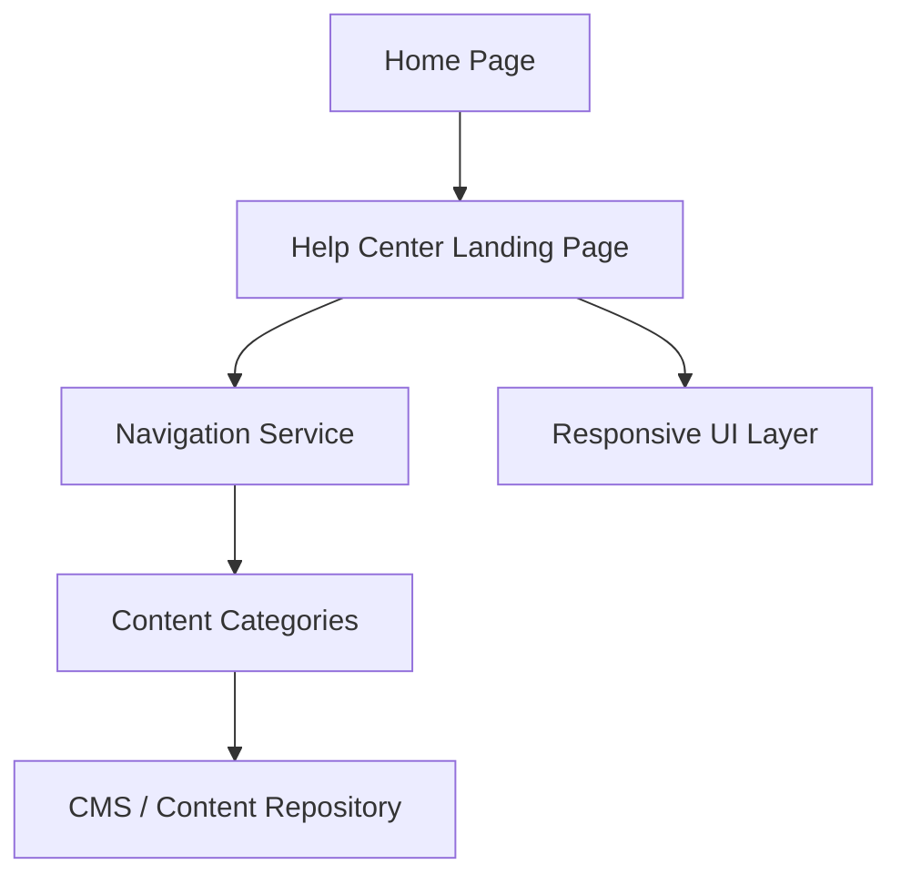

#### 1. High-Level Design

- **Summary:** This epic establishes the Help Center entry point on the Home Page and creates a dedicated landing page with categorized content organization (Getting Started, FAQs, Troubleshooting). The implementation ensures responsive design across all devices, WCAG 2.1 AA accessibility compliance, brand alignment, and high performance (2s desktop, 4s mobile load times) supporting 100,000 concurrent users.

- **Component Flow:**

- **Integration Points:**
  - Upstream: Existing website infrastructure and CMS (content management system for Help Center content)
  - Upstream: Existing Home Page layout and navigation system (integration point for Help Center entry link)
  - Downstream: Content Repository (source of categorized help content)

- **Key Assumptions:**
  - Help Center entry point is added to main navigation bar or as a prominent section on Home Page; exact placement determined by UX team.
  - Content categories (Getting Started, FAQs, Troubleshooting) are predefined and managed within existing CMS.

- **NFR Highlights:** Landing page loads <2s (desktop broadband), <4s (mobile); 100,000 concurrent users; 99.9% uptime; WCAG 2.1 AA compliance (keyboard navigation, screen reader support).

- **Data Flow:** User navigates to Home Page → Clicks Help Center entry point → Navigation Service routes to Help Center Landing Page → Responsive UI Layer renders page optimized for device type → Content Categories displayed, pulling metadata from CMS/Content Repository → User selects category → Navigation Service retrieves and displays categorized content. All interactions support keyboard navigation and screen reader accessibility.

#### 2. Validation Report

- **Requirements Coverage:** The design fully addresses the epic's scope including Help Center entry point, dedicated landing page, categorized navigation, responsive design, accessibility (WCAG 2.1 AA), branding alignment, and all performance/scalability NFRs (2s/4s load times, 100,000 concurrent users, 99.9% uptime). Integration with existing website infrastructure and CMS is clearly defined.