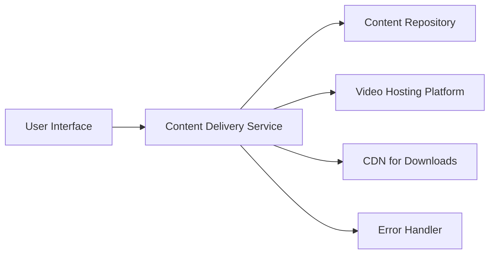

#### 1. High-Level Design

- **Summary:** This epic delivers Help Center content in three formats: text-based articles/FAQs, embedded video tutorials, and downloadable materials (PDFs, guides). Content is served securely over HTTPS with optimized performance (2-3s load times), robust error handling, and support for 100,000 concurrent users across all device types.

- **Component Flow:**

- **Integration Points:**
  - Upstream: Video hosting platform for tutorials (e.g., Vimeo, YouTube, or internal video service)
  - Upstream: Content Delivery Network (CDN) for downloadable materials (e.g., CloudFront, Akamai)
  - Upstream: Editorial team for content creation and maintenance (content authoring workflow)
  - Downstream: Content Repository (centralized content database)

- **Key Assumptions:**
  - Video files are transcoded and stored on the video hosting platform; embed codes/URLs are stored in Content Repository.
  - Downloadable files (PDFs) are pre-uploaded to CDN; Content Repository stores CDN URLs for retrieval.

- **NFR Highlights:** Text content loads <2s; Video player loads/plays <3s; Downloads begin <2s; HTTPS only; 100,000 concurrent users supported.

- **Data Flow:** User requests content → Content Delivery Service retrieves metadata from Content Repository → For text: HTML/JSON served directly. For video: Embed URL fetched, video player loads from Video Hosting Platform. For downloads: CDN URL returned, file download initiated from CDN. Error Handler intercepts failures (404, timeouts) and displays meaningful messages with alternative actions.

#### 2. Validation Report

- **Requirements Coverage:** The design comprehensively covers all content formats (text, video, downloadable materials), performance requirements (2-3s load times), security (HTTPS), scalability (100,000 concurrent users), and error handling. Integration with video hosting platform and CDN ensures optimized delivery. All stated NFRs and dependencies are addressed in the architecture.