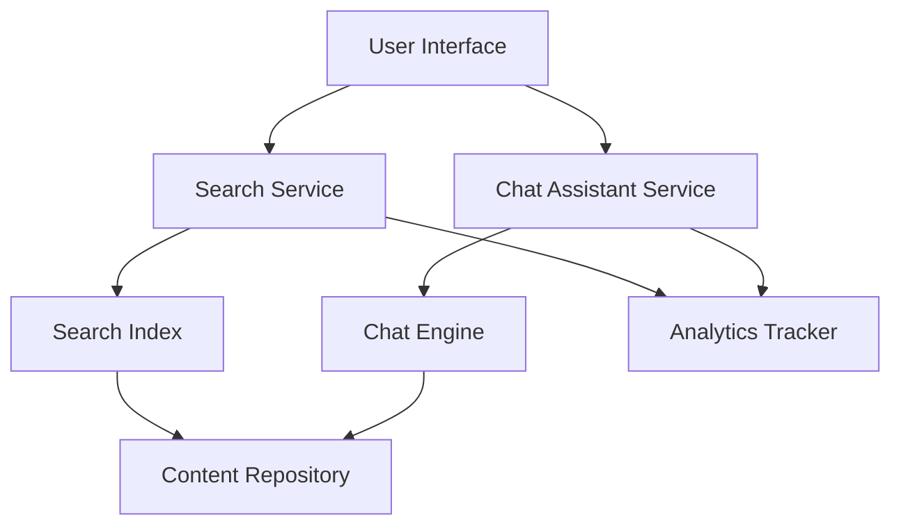

#### 1. High-Level Design

- **Summary:** This epic implements a self-service support system with two core capabilities: (1) keyword-based search across all Help Center content with sub-2-second response times, and (2) an interactive chat assistant providing automated responses and linking to relevant resources. The system must handle 10,000 simultaneous chat sessions and track analytics for both features to enable continuous content improvement.

- **Component Flow:**

- **Integration Points:** 
  - Upstream: Chat assistant technology platform (third-party or internal AI/NLP service)
  - Upstream: Search indexing system (e.g., Elasticsearch, Solr, or similar)
  - Upstream: Analytics platform for tracking user interactions (e.g., Google Analytics, custom analytics service)
  - Downstream: Content Repository (Help Center content database)

- **Key Assumptions:** 
  - Search indexing system is pre-configured and maintained separately; content is indexed in near real-time.
  - Chat assistant uses a rule-based or simple NLP engine (not advanced AI/ML) with predefined response templates.

- **NFR Highlights:** Search results <2s; Chat window opens <2s; 10,000 simultaneous chat sessions; HTTPS only; 99.9% uptime; No sensitive data exposure.

- **Data Flow:** User submits search query → Search Service queries Search Index → Results retrieved from Content Repository → Displayed to user within 2s. For chat: User sends message → Chat Assistant Service processes via Chat Engine → Retrieves relevant content from Content Repository → Returns automated response with links. Both interactions logged to Analytics Tracker for monitoring and improvement.

#### 2. Validation Report

- **Requirements Coverage:** The design fully addresses the epic's scope including keyword search, chat assistant, analytics tracking, performance requirements (2s response times), scalability (10,000 concurrent sessions), and security (HTTPS, no sensitive data exposure). All stated NFRs are incorporated into the architecture with dedicated services for search, chat, and analytics.