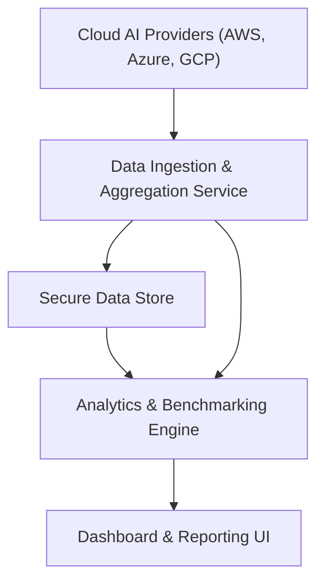

#### 1. High-Level Design
- Summary: Develop a secure, cloud-based dashboard that aggregates, visualizes, and analyzes AI usage and spend data across portfolio companies, enabling real-time portfolio and company-level insights, benchmarking, drill-down analytics, and exportable reports for partner personas.

- Component Flow:

- Integration Points: 
  - Secure API access to AI usage and spend data from AWS, Azure, and GCP.
  - Potential future integrations with niche or emerging AI platforms for expanded coverage.
  - Synthetic performance monitoring for dashboard load time KPIs.
  - Data freshness monitoring and automated checks.

- Key Assumptions:
  - AI usage and spend data APIs from cloud providers expose standardized, machine-readable formats (e.g., JSON/REST) sufficient for aggregation.
  - Data freshness checks are executed at least hourly to support “real-time views” and 24-hour freshness notifications.

- NFR Highlights: 
  - Supports up to 200 portfolio companies and 1,000 concurrent users with <3s dashboard load time for 95% of interactions, 99.5% uptime with automated failover and daily backups, WCAG 2.1 AA accessibility, and TLS 1.2+/AES-256 encryption for data in transit and at rest.

- Data Flow:
  - Cloud AI providers (AWS, Azure, GCP) expose AI usage and spend metrics via secure APIs.
  - The Data Ingestion & Aggregation Service periodically pulls this data, normalizes it, and writes consolidated records to the Secure Data Store.
  - The Data Freshness monitoring logic flags stale or missing data and triggers notifications or indicators.
  - The Analytics & Benchmarking Engine reads aggregated data from the Secure Data Store to compute portfolio-level views, company-level drill-down analytics, benchmarking, cost-saving recommendations, and scenario simulations.
  - The Dashboard & Reporting UI retrieves processed analytics to render real-time dashboards, drill-down views, benchmarking tools, data freshness indicators, and generates exportable PDF/Excel reports and executive summaries.

#### 2. Validation Report
- Requirements Coverage: 
  - The proposed design covers real-time AI usage and spend aggregation, portfolio-level and company-level dashboards, benchmarking tools, drill-down analytics, data freshness indicators, outdated data notifications, report generation and export (PDF/Excel), executive summary views, cost-saving recommendations, scenario simulation, and personalized dashboard customization, while aligning with the stated NFRs (performance, scalability, uptime, accessibility, and encryption) and dependencies (cloud provider APIs, portfolio integrations, performance monitoring, and data freshness checks).