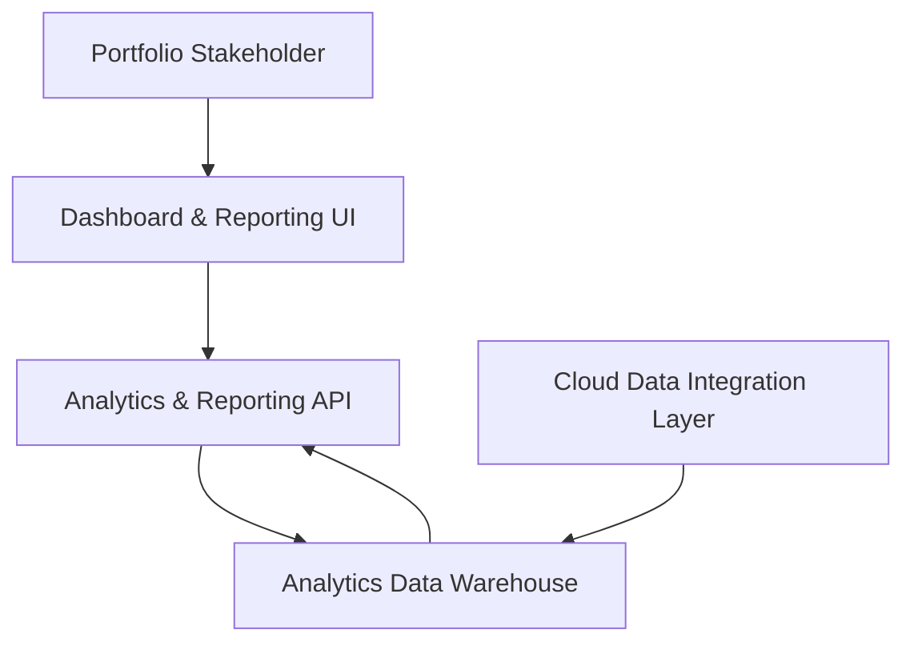

#### 1. High-Level Design
- Summary: Deliver a consolidated, near real-time dashboard for portfolio-wide and company-level AI usage and spend, with benchmarking, drill-down analytics, data freshness indicators, KPIs, and exportable reports for both technical and non-technical stakeholders.
- Component Flow:

- Integration Points: Aggregated AI usage and spend data from integrated cloud providers (AWS, Azure, GCP AI services) via the existing integration layer; SSO solution for authentication and session management; internal analytics and reporting services for KPIs, benchmarks, drill-down views, and exports.
- Key Assumptions:
  - The integration layer already provides sufficiently normalized and timely AI usage/spend data to the analytics data warehouse.
  - Existing analytics/reporting services can support PDF and Excel export generation within acceptable performance bounds for the defined data volumes.
- NFR Highlights: Must support onboarding up to 200 portfolio companies and 1,000 concurrent users, ensure dashboard pages load within 3 seconds for 95% of interactions, encrypt all data in transit and at rest (TLS 1.2+, AES-256), enforce RBAC with audit logging, meet WCAG 2.1 AA accessibility, and achieve 99.5% uptime with automated failover and daily backups.
- Data Flow: The Cloud Data Integration Layer supplies aggregated AI usage and spend data into the Analytics Data Warehouse at configured intervals. The Analytics & Reporting API queries the warehouse to compute KPIs, benchmarks, company/department/project drill-downs, and data freshness indicators. The Dashboard UI, accessed via SSO-authenticated sessions, renders portfolio and company-level views, highlighting anomalies, stale data, and benchmarks. When users request exports, the UI calls the reporting services through the API to generate and deliver PDF/Excel files based on current analytics data.

#### 2. Validation Report
- Requirements Coverage: The design supports consolidated portfolio and company-level dashboards, data freshness indicators, drill-down analytics, benchmarking, executive summaries, and report exports, while satisfying the performance, scalability, security, accessibility, and availability NFRs explicitly stated in the epic.

---
