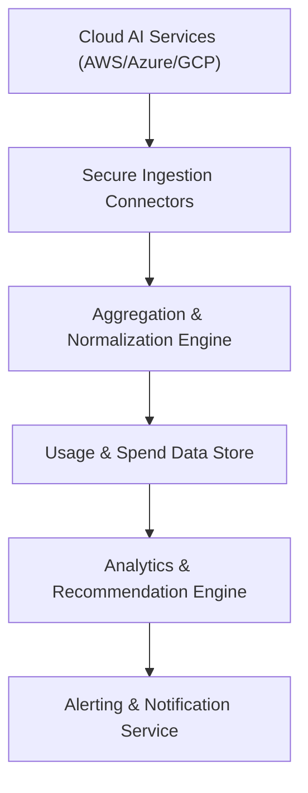

#### 1. High-Level Design
- Summary: Securely ingest, normalize, and enrich AI usage and spend data from AWS, Azure, GCP, and future AI platforms, then provide budget-aware alerts and AI/rule-based cost optimization recommendations and consolidation scenarios for portfolio companies.
- Component Flow:

- Integration Points: Direct API integrations with AWS AI services, Azure AI services, GCP AI services (and future niche platforms); internal rules/AI engines for recommendations and simulations; alerting infrastructure (email/notification service); portfolio companies’ cloud accounts and permissions for data access.
- Key Assumptions:
  - Cloud providers expose required AI usage and billing metrics via stable, authenticated APIs with sufficient rate limits for up to 200 portfolio companies.
  - The existing alerting infrastructure can handle near-real-time notifications (within 5 minutes of data sync) to Operating Partners.
- NFR Highlights: Must support up to 200 portfolio companies while keeping AI usage/spend data no older than 24 hours, send budget breach alerts within 5 minutes of the next sync, maintain 99.5% uptime with encrypted (TLS 1.2+ / AES-256) data flows, and ensure dashboards using this data load within 3 seconds for 95% of requests.
- Data Flow: Secure ingestion connectors periodically pull AI usage and cost data from each provider’s APIs for all configured portfolio-cloud accounts. The Aggregation & Normalization Engine standardizes units, dimensions, and metadata and persists the result in the central Usage & Spend Data Store. The Analytics & Recommendation Engine reads normalized data to evaluate budget thresholds, detect stale or missing data (>24 hours), and compute optimization and consolidation recommendations. Results and detected threshold breaches are fed to the Alerting Service, which sends notifications to assigned Operating Partners and surfaces insights to the dashboard.

#### 2. Validation Report
- Requirements Coverage: The design supports secure multi-cloud ingestion, normalization, stale-data detection, budget thresholds, alerts, and recommendation/simulation capabilities, and adheres to the specified scalability, freshness, alerting latency, security, performance, and reliability NFRs described in the epic.

---
