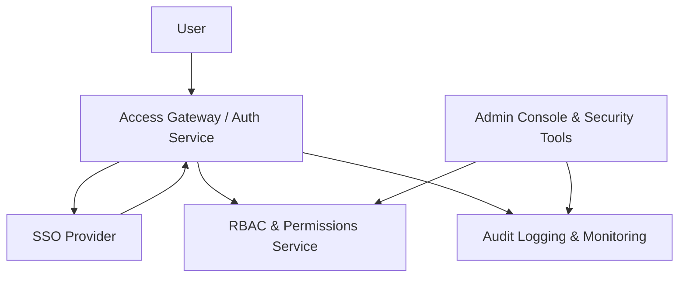

#### 1. High-Level Design
- Summary: Provide secure, compliant access management for the AI Portfolio Management Dashboard, including RBAC, SSO authentication, audit logging, user lockout/recovery, and admin tools to manage integrations, permissions, and security events at enterprise scale.
- Component Flow:  

- Integration Points: Existing SSO provider for authentication and session management; centralized logging/monitoring systems for audit logs and security events; cloud provider IAM for integration-level access; notification/email services for lockout recovery and security notifications.
- Key Assumptions:
  - SSO provider supports modern federation standards (e.g., SAML/OIDC) and provides user identity attributes and group claims needed for RBAC.
  - Centralized logging platform is already provisioned and can accept structured security/audit events from this dashboard.
- NFR Highlights: Must support up to 1,000 concurrent users with all data encrypted in transit (TLS 1.2+) and at rest (AES-256), 99.5% uptime, dashboard/admin page loads within 3 seconds for 95% of interactions, WCAG 2.1 AA accessibility, and mandatory RBAC plus audit logging on all portfolio data access.
- Data Flow: User requests are routed through the Access Gateway, which delegates authentication to the SSO provider and receives identity tokens. The gateway consults the RBAC & Permissions Service to authorize access to portfolio/company data and administrative functions. All authenticated actions (logins, access attempts, permission changes, security events) are sent as structured events to the Audit Logging & Monitoring system. Admins use the Admin Console to configure roles, company-level access, integrations, and to review audit/security alerts, which in turn updates RBAC policies and interacts with notification services for lockout and recovery workflows.

#### 2. Validation Report
- Requirements Coverage: The described design covers SSO-based authentication, role-based access control, enterprise admin configuration, audit logging, and lockout/recovery workflows, and aligns with the stated NFRs around security, performance, availability, and accessibility for enterprise-scale adoption.

---
