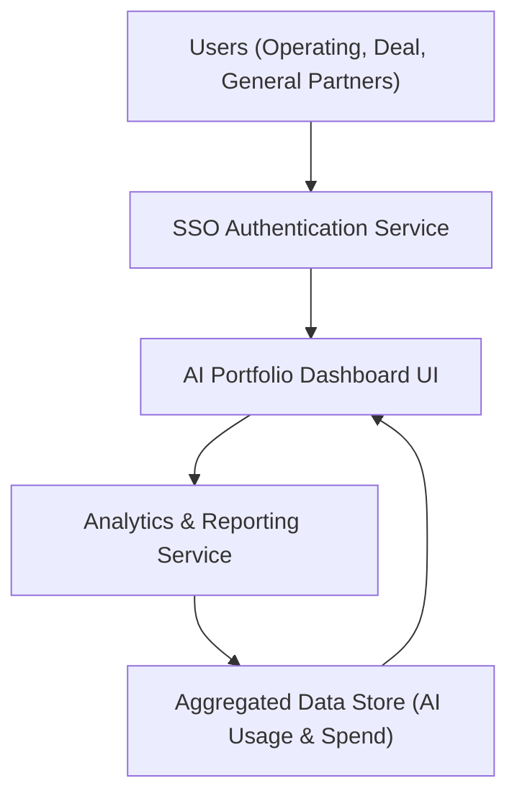

#### 1. High-Level Design
- Summary: Deliver a consolidated, near real-time dashboard that visualizes AI usage and spend across all portfolio companies, supports portfolio- and company-level drill-down, benchmarking, scenario modeling, and exportable reports for both technical and non-technical stakeholders.

- Component Flow:  

- Integration Points: 
  - Upstream: Aggregated AI usage and spend data from AWS, Azure, and GCP via secure APIs (through existing ingestion services).  
  - Upstream: SSO provider for user authentication and personalized views.  
  - Internal: Analytics and reporting services that compute benchmarking metrics, scenario simulations, and generate PDF/Excel exports.

- Key Assumptions:
  - Aggregated AI usage and spend data is already cleaned, normalized, and made available in the Aggregated Data Store with a consistent schema across providers.
  - Benchmarking reference data (peer portfolio benchmarks and industry averages) is either pre-computed or available via internal analytics services on a daily or near real-time refresh schedule.

- NFR Highlights: 
  - Dashboard pages must load within 3 seconds for 95% of interactions, support up to 200 portfolio companies and 1,000 concurrent users, meet WCAG 2.1 AA accessibility, maintain 99.5% uptime, and ensure dashboard data is no older than 24 hours for connected providers.

- Data Flow:
  - Inputs: Aggregated AI usage and spend data (per portfolio company, department, project), benchmarking baselines (peer portfolio and industry averages), user identity and role from SSO.
  - Processing:  
    - Analytics & Reporting Service computes portfolio-level overviews, company drill-down metrics, benchmarks, and scenario simulations (e.g., vendor consolidation, parameter adjustments).  
    - The service aggregates metrics per company, department, and project, applies time windows, and calculates KPIs (spend, usage, savings estimates).
  - Outputs:  
    - Dashboard UI renders portfolio-wide overview, detailed company-level views, benchmarking charts, and scenario modeling outputs.  
    - Users can trigger report generation, which uses Analytics & Reporting Service to create PDFs/Excel files for export and sharing with boards and investors.

#### 2. Validation Report
- Requirements Coverage: The proposed design supports portfolio- and company-level dashboards, real-time visualization, benchmarking against peers and industry averages, configurable and personalized views, scenario modeling for cost savings, and report exports in PDF/Excel, aligning with the epic’s stated scope and NFRs.