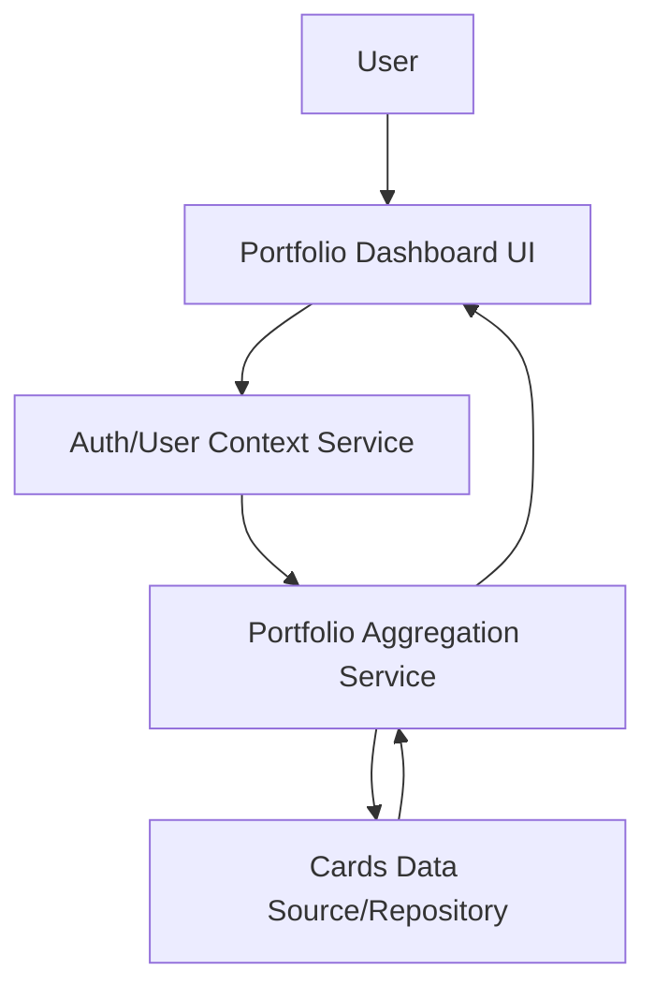

#### 1. High-Level Design
- Summary: Deliver a responsive dashboard consolidating all user credit cards into one view, displaying portfolio-level KPIs such as monthly spend, total credit limit, available credit, and outstanding amounts, with navigation to more detailed views.
- Component Flow:

- Integration Points: Internal cards data source or mocked card repository for limits, balances, and transactions; user/account context service to determine which cards belong to the logged-in user.
- Key Assumptions:
  - The cards data source can provide both per-card details and aggregated transaction metrics needed for monthly spend KPI.
  - Authentication and user context are resolved before dashboard data requests, providing a stable user identifier to all downstream services.
- NFR Highlights: Dashboard KPIs must render within acceptable UX response times and the layout must remain readable across common desktop, tablet, and mobile resolutions.
- Data Flow: User opens the Portfolio Dashboard UI, which contacts the Auth/User Context Service to identify the user; the Portfolio Aggregation Service uses this context to query the Cards Data Source/Repository for all associated cards and their balances, limits, and transactions; the service computes portfolio-level KPIs (monthly spend, total limit, available credit, outstanding amount) and returns them to the UI, which presents a consolidated snapshot with navigation options to card-level or analytic views.

#### 2. Validation Report
- Requirements Coverage: The design provides a consolidated multi-card dashboard, supports the specified KPIs, ensures responsive and adaptive layout, and aligns portfolio overview with potential detailed views as described in the epic’s scope and NFRs.
