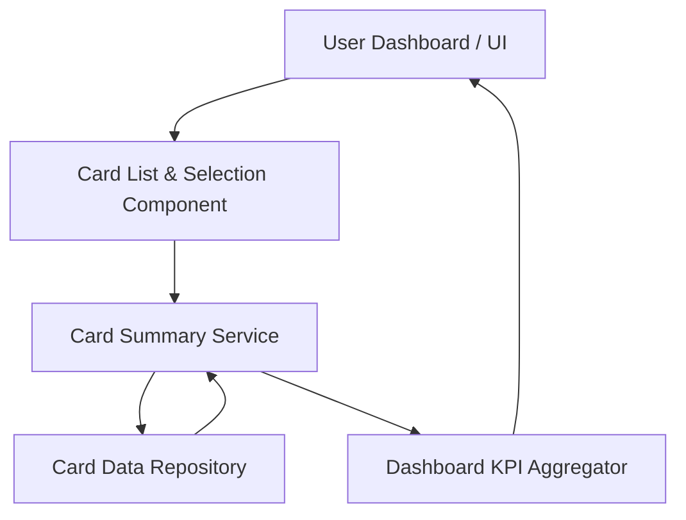

#### 1. High-Level Design
- Summary: Enable users to manage and view multiple credit cards in a single interface, showing per-card credit limit, available credit, and outstanding balance, with simple switching/filtering between cards.
- Component Flow:

- Integration Points: Card data repository/service providing per-card limits, utilization, and balances; user identity/profile service to fetch cards associated with the logged-in user (implied by dependencies).
- Key Assumptions:
  - Each card has a unique identifier used consistently across dashboard, card repository, and KPI aggregation.
  - Card selection events from the UI are propagated to both card detail views and KPI aggregations in a unified manner.
- NFR Highlights: System must handle multiple cards per user without noticeable degradation in card-switch responsiveness and must present card data consistently and accurately across views.
- Data Flow: User accesses the dashboard UI, which loads the Card List & Selection Component; upon card selection, the Card Summary Service queries the Card Data Repository for that card’s limit, available credit, and outstanding amount; the service updates the Dashboard KPI Aggregator to align KPIs with the selected card, and the combined data is rendered back to the UI for both list/tile view and card-specific KPIs.

#### 2. Validation Report
- Requirements Coverage: The design supports multiple cards in one interface, per-card limit/available/ outstanding KPIs, and card selection/filtering, while ensuring consistency with dashboard KPIs and responsive card switching as specified in the epic.
