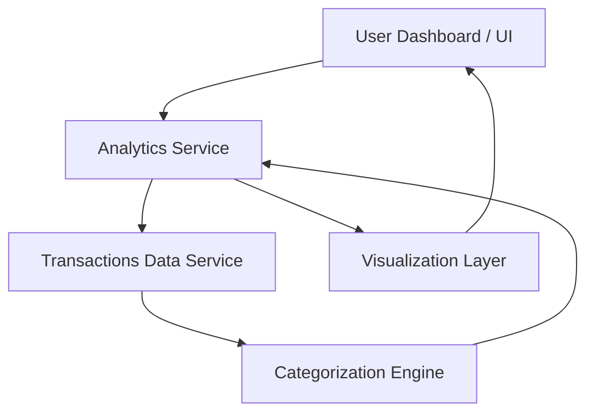

#### 1. High-Level Design
- Summary: Provide analytical capabilities to help users understand spending over time and by category, including monthly spend trends, card-wise spend analysis, and interactive category-level charts aligned with dashboard KPIs.
- Component Flow:

- Integration Points: Transactions data source/service for transaction-level details; categorization logic or mapping service; shared user/card context consistent with the main dashboard.
- Key Assumptions:
  - Transactions are already cleansed and enriched with necessary attributes (amount, timestamp, merchant, card, etc.).
  - Time-range and card filters are passed from the dashboard in a standardized format (e.g., ISO dates, card IDs).
- NFR Highlights: Analytics views must update within acceptable UX response times and maintain accuracy and consistency of category aggregations across all charts.
- Data Flow: User selects filters on the dashboard UI, which invokes the Analytics Service; the service pulls raw transactions from the Transactions Data Service, invokes the Categorization Engine to map each transaction to a category, aggregates data into monthly and category buckets, and returns aggregated datasets to the Visualization Layer, which renders interactive charts back to the user.

#### 2. Validation Report
- Requirements Coverage: The design covers monthly spend trends, card-wise spend analysis, standardized category breakdown, alignment with dashboard KPIs, and supports responsive, filter-driven analytics updates as described in the epic.
