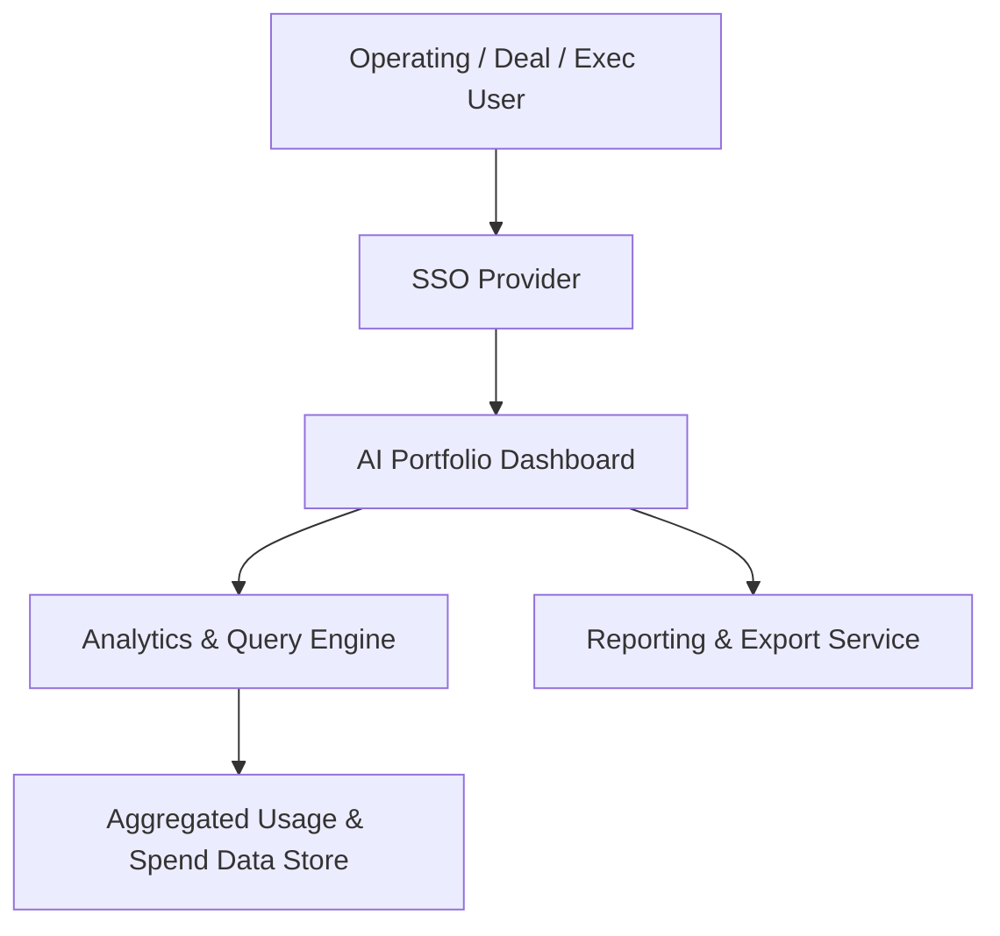

#### 1. High-Level Design
- Summary: Deliver a consolidated real-time dashboard that visualizes AI usage and spend across all portfolio companies, with drill-down analytics, benchmarking, configurable views, executive summaries, and exportable reports.
- Component Flow:

- Integration Points:
  - Aggregated AI usage and spend data from integrated cloud providers (AWS, Azure, GCP) via the central data store.
  - SSO provider for user authentication.
  - RBAC and audit logging services for secure dashboard access.
  - Reporting/export subsystem for PDF and Excel generation.
- Key Assumptions:
  - Benchmarking uses a predefined and centrally maintained set of industry averages and peer group definitions.
  - Exported reports (PDF/Excel) are generated asynchronously with status tracking within the dashboard.
- NFR Highlights: Dashboard loads within 3 seconds for 95% of interactions with up to 50 portfolio companies; supports 200 companies and 1,000 concurrent users; end-to-end encryption (TLS 1.2+, AES-256); RBAC and audit logging mandatory; WCAG 2.1 AA compliance; 99.5% uptime with automated failover and daily backups.
- Data Flow: Users authenticate via SSO and access the AI Portfolio Dashboard, which uses the Analytics & Query Engine to query the Aggregated Usage & Spend Data Store. The engine computes portfolio-wide and company-level metrics, drill-down views, benchmarks, and ROI summaries, returning results to the dashboard UI. When users request reports, the dashboard delegates to the Reporting & Export Service, which pulls data from the same store and produces PDF/Excel outputs for download or distribution.

#### 2. Validation Report
- Requirements Coverage: The design supports consolidated portfolio dashboards, real-time usage/spend visualization, company-level and drill-down analytics, benchmarking, configurable and executive views, and PDF/Excel exports, while conforming to the performance, scalability, security, accessibility, and availability constraints described in the epic.
