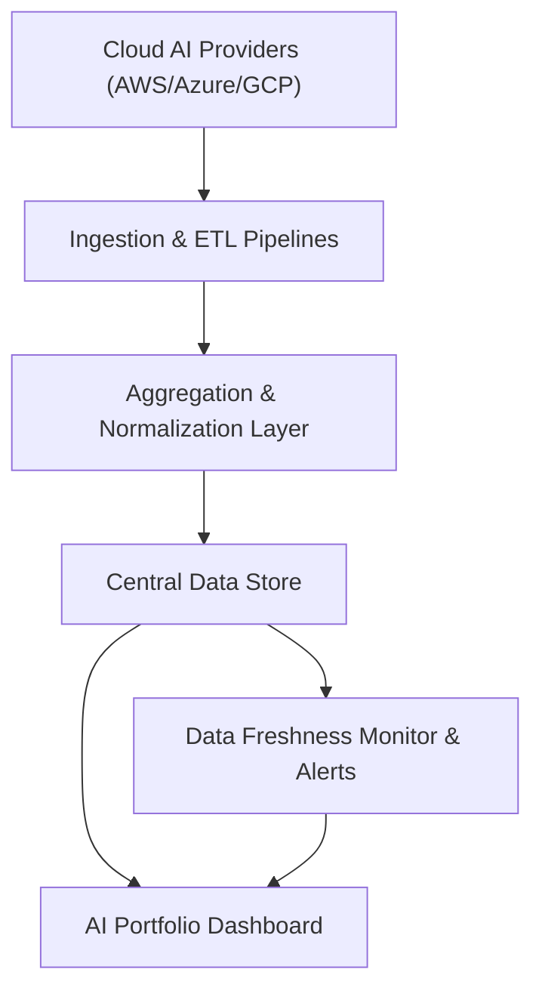

#### 1. High-Level Design
- Summary: Implement secure integrations with major cloud AI providers (AWS, Azure, GCP), automated AI usage/spend ingestion, portfolio-wide aggregation and normalization, data freshness monitoring, and notifications when data is missing or stale.
- Component Flow:

- Integration Points:
  - Direct secure APIs to AWS, Azure, and GCP AI services.
  - Centralized logging and monitoring for data pipelines.
  - Existing SSO solution for authenticated access to integration configuration.
  - Future hooks for niche/emerging AI platforms (beyond MVP, as noted).
- Key Assumptions:
  - Portfolio companies provide and maintain required API credentials and permissions for their cloud accounts.
  - Data sync schedules are centrally configured and applied per portfolio company, with defaults meeting the 24-hour freshness requirement.
- NFR Highlights: Data must be ≤24 hours old; aggregated usage/spend displayed within 3 seconds; TLS 1.2+ and AES-256 for all data; supports up to 200 portfolio companies and 1,000 concurrent users; 99.5% uptime with automated failover and daily backups.
- Data Flow: Cloud AI Providers expose usage and spend metrics via secure APIs consumed by Ingestion & ETL Pipelines. These pipelines transform and send data into the Aggregation & Normalization Layer, which standardizes metrics and persists them into the Central Data Store. The Data Freshness Monitor inspects timestamps and completeness, raising alerts or flags when data is missing or older than defined thresholds. The AI Portfolio Dashboard queries the Central Data Store for analytics and surfaces freshness indicators and notifications to users.

#### 2. Validation Report
- Requirements Coverage: The design covers secure multi-cloud integrations, automated ingestion and aggregation, configurable data sync schedules, data freshness indicators, and notifications for missing/stale data, aligning with the NFRs on freshness, performance, scalability, security, and availability stated in the epic.
