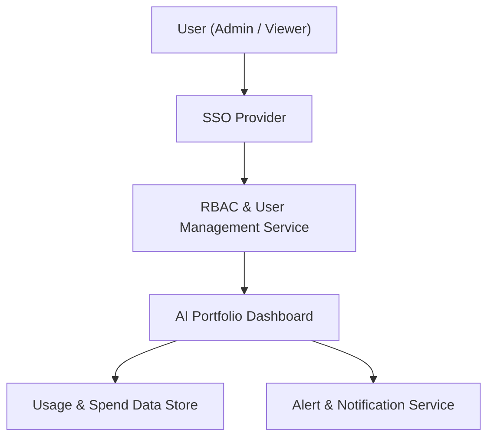

#### 1. High-Level Design
- Summary: Provide secure role-based access control, user management and lockout recovery, budget threshold alerts, data completeness alerts, and AI cost optimization recommendations/simulations to enable safe and compliant use of the AI portfolio dashboard.
- Component Flow:

- Integration Points:
  - Existing SSO solution for authentication.
  - RBAC service or equivalent mechanism for permission enforcement.
  - Email/notification services for alerts and lockout recovery messages.
  - Aggregated AI usage and spend data from integrations for budget monitoring and recommendations.
  - Logging and monitoring infrastructure for audit logs and security events.
- Key Assumptions:
  - Budget threshold alerts piggyback on existing notification infrastructure (email/Slack/Teams) configured at the org level.
  - Cost optimization simulations use existing aggregated usage data and do not require direct write-back into cloud providers.
- NFR Highlights: All data encrypted in transit (TLS 1.2+) and at rest (AES-256); RBAC and audit logging mandatory; alerts for budget breaches within 5 minutes of next data sync; lockout reset emails within 2 minutes; supports 1,000 concurrent users; WCAG 2.1 AA for security and alert configuration.
- Data Flow: Users authenticate via SSO, which passes identity to the RBAC & User Management Service. RBAC evaluates permissions and grants access to the AI Portfolio Dashboard. The dashboard reads AI usage and spend data from the Usage & Spend Data Store, applies thresholds and policies, and triggers alert events to the Alert & Notification Service. Audit logs and access attempts flow to the logging/monitoring subsystem for security tracking and compliance.

#### 2. Validation Report
- Requirements Coverage: The design covers role-based access control, SSO-based authentication, user lockout and recovery flows, budget threshold alerting, data completeness alerts, and AI cost optimization recommendations and simulations, while satisfying the stated security, performance, and alerting NFRs and leveraging the specified dependencies.
