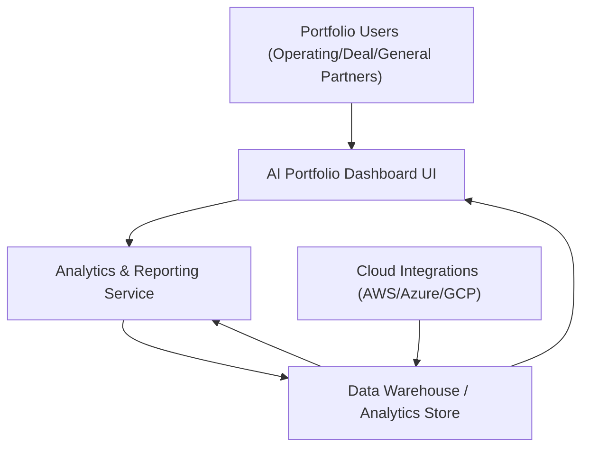

#### 1. High-Level Design

- Summary: This epic delivers a consolidated, real-time AI portfolio analytics capability that aggregates AI usage and spend across all portfolio companies, with benchmarking, drill-down analytics, and executive-level reporting to quantify AI maturity and value creation.

- Component Flow:

- Integration Points:
  - Integrations with AWS, Azure, and GCP AI services to supply standardized AI usage and spend data.
  - SSO provider integration for user authentication.
  - Dependencies on portfolio companies’ cloud accounts and their willingness to enable and maintain integrations.

- Key Assumptions:
  - AI usage and spend data from AWS, Azure, and GCP is available in a format that can be normalized into a common schema for portfolio analytics.
  - Benchmarking against “industry averages” relies on either pre-configured external reference datasets or manually configured baseline values, not automatically scraped sources.

- NFR Highlights:
  - Must support up to 200 portfolio companies and 1,000 concurrent users, with dashboard pages loading within 3 seconds for 95% of interactions; all data must be encrypted in transit and at rest, with WCAG 2.1 AA accessibility and 99.5% uptime.

- Data Flow:
  - AI usage and spend data is ingested from cloud integrations (AWS/Azure/GCP) into a centralized data warehouse/analytics store, where it is normalized and aggregated. The Analytics & Reporting Service computes portfolio views, benchmarking metrics, drill-down analytics, and pre-/post-investment comparisons. The AI Portfolio Dashboard UI retrieves aggregated and detailed data from the analytics store, presenting real-time portfolio dashboards, drill-down views, data freshness indicators, and exportable reports to portfolio users authenticated via SSO.

#### 2. Validation Report

- Requirements Coverage: The proposed design covers the epic’s scope by providing a consolidated portfolio dashboard, company-level and drill-down analytics, benchmarking tools, pre- and post-investment comparison reports, monthly executive summaries, and export capabilities, while aligning with specified non-functional requirements for performance, scalability, security, accessibility, and reliability.