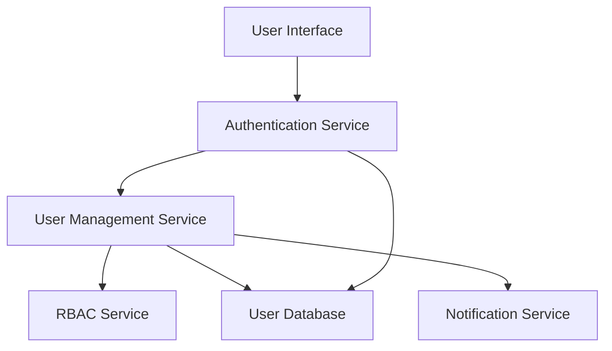

#### 1. High-Level Design

- **Summary**: This epic provides complete user lifecycle management including registration, authentication, and role-based access control (RBAC) for consumers, sellers, and administrators. It enables secure onboarding, identity management, account management, password recovery, email confirmation, and user profile management across all user personas.

- **Component Flow**:

- **Integration Points**: 
  - Email/SMS notification providers for confirmation emails and alerts
  - Cloud hosting services for user data storage
  - Third-party authentication services if applicable

- **Key Assumptions**: 
  - User credentials are hashed using industry-standard algorithms (e.g., bcrypt) before storage
  - Role assignments (consumer, seller, admin) are determined at registration and can be modified by administrators

- **NFR Highlights**: All user data encrypted at rest and in transit; support 100,000 concurrent users; PCI DSS compliance; account lockout for suspicious activity; WCAG 2.1 AA accessibility; 99.9% uptime SLA

- **Data Flow**: Users interact with the User Interface to register or authenticate. The Authentication Service validates credentials against the User Database and issues secure session tokens. The User Management Service handles registration workflows, account management, password recovery, and profile updates, storing data in the User Database. The RBAC Service enforces role-based permissions (consumer, seller, admin) throughout the platform. The Notification Service sends email confirmations during registration and password recovery. All user data is encrypted, and suspicious login attempts trigger account lockout mechanisms.

#### 2. Validation Report

- **Requirements Coverage**: The design fully addresses the epic scope including user registration for buyers and sellers, authentication and login, role-based access control for three personas, account management, password recovery, email confirmation, and user profile management. All NFRs are satisfied: encryption for all user data, scalable architecture supporting 100,000 concurrent users, PCI DSS compliance for payment-related user data, account lockout mechanisms for suspicious activity detection, WCAG 2.1 AA accessibility standards, and 99.9% uptime through redundant, highly-available deployment. The RBAC Service ensures appropriate feature access for each user role as specified.