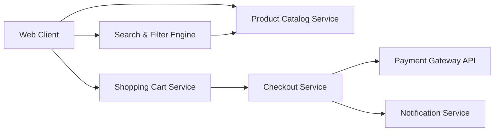

#### 1. High-Level Design

- **Summary**: This epic delivers a comprehensive product catalog and shopping experience enabling consumers to discover products through search, filtering, and sorting, manage shopping carts, and complete secure checkout with integrated payment processing. It includes product reviews, ratings, wishlist functionality, and order confirmation workflows.

- **Component Flow**:

- **Integration Points**: 
  - Third-party payment gateway APIs for payment processing
  - Cloud hosting and CDN services for product images and content delivery
  - Email/SMS notification providers for order confirmations

- **Key Assumptions**: 
  - Product search uses indexed catalog with full-text search capabilities
  - Shopping cart data persists across sessions for registered users; session-based for guest users

- **NFR Highlights**: Page load times ≤2 seconds for 95% of requests; checkout completes within 5 seconds; support 10,000 transactions per minute with horizontal scaling; PCI DSS compliance; 99.9% uptime SLA; WCAG 2.1 AA accessibility

- **Data Flow**: Consumers browse products via the Web Client, which queries the Product Catalog Service. The Search & Filter Engine provides advanced discovery capabilities by indexing and querying the catalog. Selected products are added to the Shopping Cart Service, which maintains cart state. During checkout, the Checkout Service orchestrates the transaction, communicates with the Payment Gateway API for secure payment processing, and triggers the Notification Service to send order confirmations. Product images and static content are delivered via CDN for optimal performance.

#### 2. Validation Report

- **Requirements Coverage**: The design comprehensively addresses all scope elements including product catalog with search/filter/sort, shopping cart management, checkout workflow, secure payment integration with multiple payment methods, product reviews and ratings, wishlist functionality, and order confirmation notifications. All NFRs are met: 2-second page loads via CDN and optimized catalog service, 5-second checkout through streamlined workflow, 10,000 TPS capacity via horizontal scaling, encryption and PCI DSS compliance through payment gateway integration, fraud detection mechanisms, WCAG 2.1 AA accessibility standards, and 99.9% uptime through high-availability architecture.