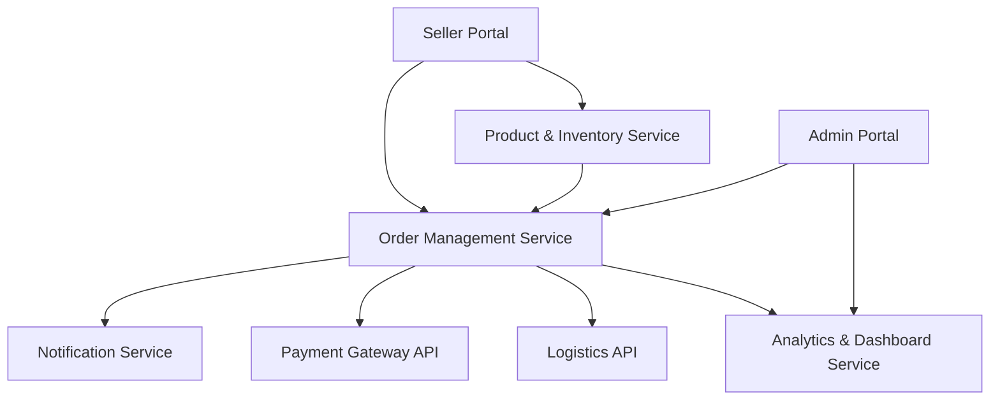

#### 1. High-Level Design

- **Summary**: This epic delivers comprehensive order lifecycle management and seller operations capabilities for an online shopping platform. It encompasses seller product listing and inventory management, order processing and tracking with real-time updates, automated notifications, cancellation and refund workflows, seller and admin dashboards with analytics, dispute resolution, and fraud detection mechanisms.

- **Component Flow**:

- **Integration Points**: 
  - Third-party logistics APIs for automatic shipping updates
  - Email/SMS notification providers for order and inventory alerts
  - Cloud hosting services for analytics and data storage
  - Payment gateway APIs for refund processing

- **Key Assumptions**: 
  - Product catalog data format follows standard e-commerce schema (SKU, price, description, images)
  - Order status updates are event-driven and propagated through message queue for real-time processing

- **NFR Highlights**: Order tracking must update in real-time; notifications within 1 minute; support 100,000 concurrent users; 99.9% uptime SLA; refunds initiated within 24 hours; 30-minute recovery from critical failures

- **Data Flow**: Sellers create product listings through the Seller Portal, which are stored in the Product & Inventory Service. When orders are placed, the Order Management Service processes them, triggers notifications via the Notification Service, coordinates with Payment Gateway API for refunds, and receives shipping updates from Logistics API. Order and sales data flows to the Analytics & Dashboard Service for both seller and admin visibility. Admin Portal accesses order data for dispute resolution and fraud detection.

#### 2. Validation Report

- **Requirements Coverage**: The design fully covers the epic's stated scope including seller product listing, inventory management, order processing and tracking, real-time notifications, cancellation/refund processing, seller and admin dashboards with analytics, dispute resolution, user management, fraud detection, and low inventory alerts. All NFRs are addressed through the architecture: real-time updates via event-driven design, notification service for 1-minute delivery, scalable cloud infrastructure for 100,000 concurrent users, payment gateway integration for 24-hour refund processing, and high-availability deployment for 99.9% uptime.