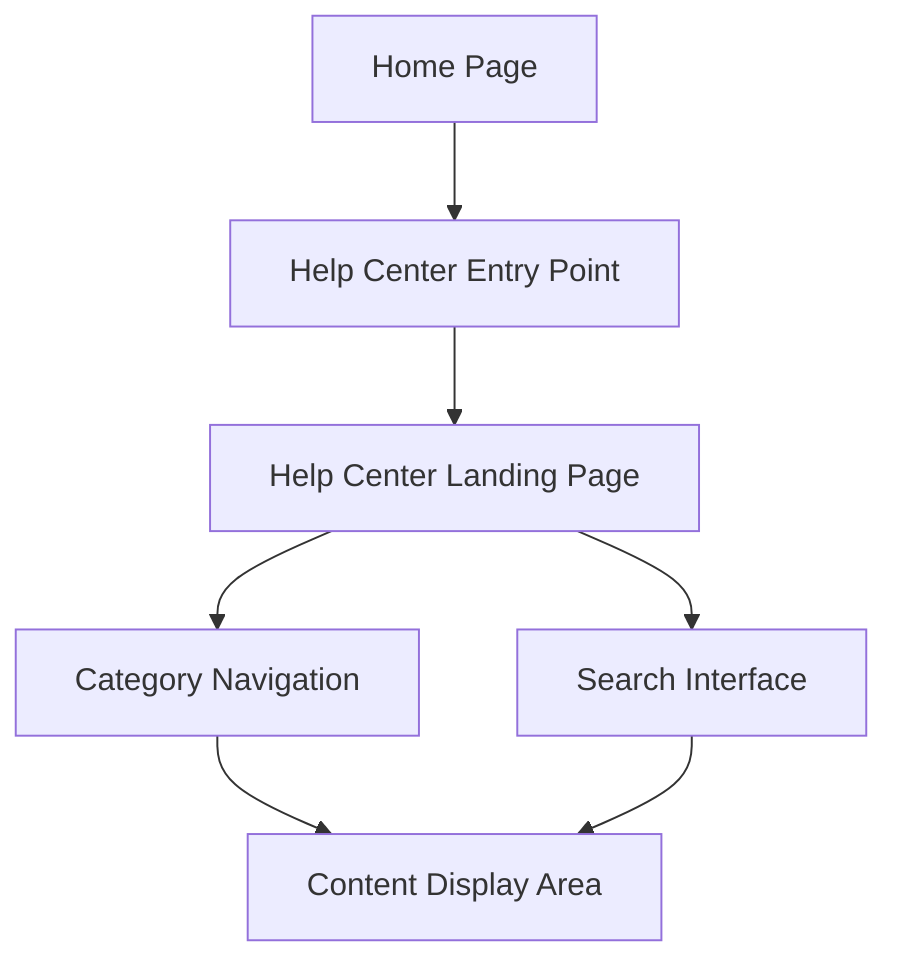

#### 1. High-Level Design

- **Summary**: This epic creates the foundational Help Center user interface including a prominent entry point on the Home Page and a dedicated landing page with categorized content organization. The interface is fully responsive, accessible (WCAG 2.1 AA), branded consistently, and provides intuitive navigation and search capabilities across all devices.

- **Component Flow**:

- **Integration Points**: 
  - Existing website infrastructure and CMS for page hosting and content management
  - Home Page layout system for entry point integration
  - Search engine/service for keyword-based content discovery
  - Content repository for categorized help materials
  - Analytics platform for usage tracking

- **Key Assumptions**: 
  - Home Page layout can accommodate a new navigation element or section without major restructuring
  - Content categories (Getting Started, FAQs, Troubleshooting) are pre-defined and maintained by the editorial team

- **NFR Highlights**: Landing page loads within 2 seconds (broadband) / 4 seconds (mobile); supports 100,000 concurrent users; 99.9% uptime with automated fallback; WCAG 2.1 AA compliant; HTTPS-only

- **Data Flow**: User visits Home Page → Clicks Help Center entry point → Navigation request routed to Help Center Landing Page → Landing page loads with categorized content structure → User browses categories or enters search query → Category Navigation or Search Interface queries content repository → Relevant content displayed in Content Display Area → If resource unavailable, error handler displays meaningful message with alternatives → All interactions tracked for analytics

#### 2. Validation Report

- **Requirements Coverage**: The design fully satisfies the epic's scope including the Help Center entry point on Home Page, dedicated landing page, categorized content organization (Getting Started, FAQs, Troubleshooting), responsive design for desktop/tablet/mobile, branding and accessibility compliance, search functionality, category-based browsing, and error handling. All NFRs are addressed: 2-4 second load times through optimized page design, 100,000 concurrent user support via scalable infrastructure, 99.9% uptime with fallback mechanisms, WCAG 2.1 AA compliance through accessible design patterns, and HTTPS security. The foundational UI enables the stated user value of reducing frustration and search time, improving satisfaction, and reducing support dependency.