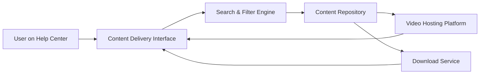

#### 1. High-Level Design

- **Summary**: This epic enables the Help Center to deliver help content in multiple formats: text articles/FAQs, embedded video tutorials, and downloadable materials (PDFs, user guides, training documents). Users can search and filter content, with robust error handling for unavailable resources. All content is secure, accessible, and performant across devices.

- **Component Flow**:

- **Integration Points**: 
  - Video hosting platform (e.g., YouTube, Vimeo, or internal CDN) for tutorial storage and streaming
  - Existing website infrastructure and CMS for content management
  - Content Repository for storing text articles, FAQs, and downloadable files
  - HTTPS/CDN infrastructure for secure content delivery
  - Editorial team's content creation and maintenance workflow

- **Key Assumptions**: 
  - Video hosting platform provides embeddable players with accessibility controls (captions, keyboard navigation)
  - Downloadable materials are stored in a CDN or file storage system with direct HTTPS access

- **NFR Highlights**: Content loads within 2 seconds (broadband) / 4 seconds (mobile); video playback within 3 seconds; downloads start within 2 seconds; supports 100,000 concurrent users; HTTPS-only; search results within 2 seconds

- **Data Flow**: User accesses Help Center → Selects content type (article, video, download) or uses search → Search & Filter Engine queries Content Repository → For text: article rendered in interface → For video: embedded player loaded from Video Hosting Platform → For downloads: Download Service initiates secure file transfer → All interactions tracked; if resource unavailable, error handler provides meaningful message and alternatives

#### 2. Validation Report

- **Requirements Coverage**: The design comprehensively addresses all content delivery requirements including text articles/FAQs, embedded video tutorials with accessible controls, downloadable materials, search and filter functionality, secure HTTPS delivery, and error handling with alternative suggestions. All NFRs are met through CDN/caching strategies (2-4 second load times), scalable infrastructure (100,000 concurrent users), video platform integration (3-second playback), and secure file delivery (HTTPS). The architecture supports the stated goal of 20% reduction in support tickets through diverse, accessible content formats.