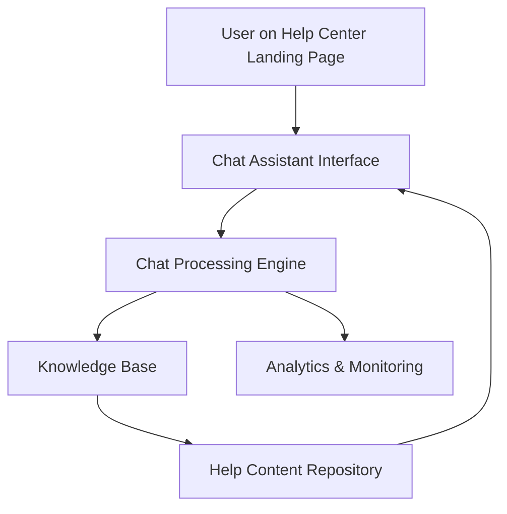

#### 1. High-Level Design

- **Summary**: This epic delivers an interactive chat assistant on the Help Center landing page that provides automated real-time support for user queries. The assistant responds to common questions, links to relevant help articles, and supports up to 10,000 simultaneous sessions with full accessibility compliance and security standards.

- **Component Flow**:

- **Integration Points**: 
  - Chat assistant technology (third-party or internal chat engine)
  - Existing website infrastructure for hosting and session management
  - Help Content Repository for contextual article links
  - Analytics platform for chat interaction tracking
  - Editorial team's knowledge base maintenance system

- **Key Assumptions**: 
  - The chat assistant uses a pre-configured knowledge base that can be updated by the editorial team without code changes
  - Chat sessions are stateless or use lightweight session storage to support 10,000 concurrent sessions

- **NFR Highlights**: Chat window opens within 2 seconds; supports 10,000 simultaneous sessions; 99.9% uptime; WCAG 2.1 AA compliant; HTTPS-only; no sensitive user data exposure

- **Data Flow**: User initiates chat from Help Center landing page → Chat interface captures query → Query sent to Chat Processing Engine → Engine queries Knowledge Base for matching responses → Relevant response and links retrieved from Help Content Repository → Response displayed to user in chat interface → Interaction logged to Analytics & Monitoring system for support staff review

#### 2. Validation Report

- **Requirements Coverage**: The design fully covers the epic's stated scope including the interactive chat assistant on the Help Center landing page, automated response capability, contextual linking to help articles, real-time query processing, responsive interface, accessibility compliance, chat interaction tracking, and support staff monitoring. All NFRs (2-second load, 10,000 concurrent sessions, HTTPS, WCAG 2.1 AA, 99.9% uptime) are addressed in the architecture through appropriate technology selection and infrastructure design.