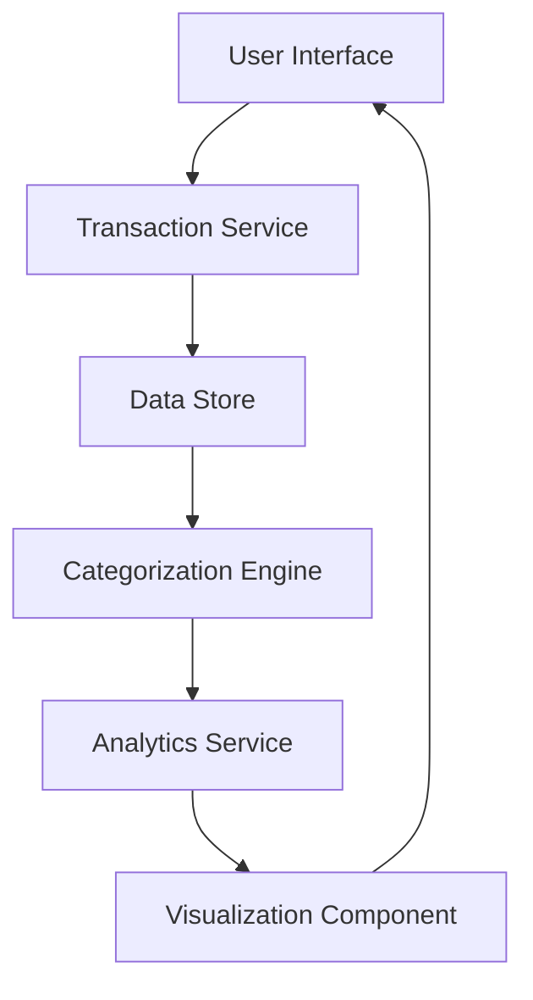

#### 1. High-Level Design

- **Summary**: This epic delivers a transaction monitoring and spending analytics capability that enables users to view all credit card transactions and analyze spending patterns through interactive category-wise visualizations. The system aggregates transaction data across multiple credit cards and categorizes spending into predefined categories (Food & Dining, Fuel, Shopping, Travel, Entertainment, Utilities, Healthcare, Education, Miscellaneous) to provide actionable insights for budget optimization and financial planning.

- **Component Flow**:

- **Integration Points**: 
  - **Upstream**: Credit card data systems/feeds for transaction data ingestion
  - **Downstream**: Categorization engine or service for automated transaction classification
  - **Internal**: Dashboard KPI service for consolidated financial metrics display

- **Key Assumptions**: 
  - Transaction data is provided in a standardized format with sufficient metadata for accurate categorization
  - Categorization rules are pre-configured or use ML-based classification with acceptable accuracy thresholds

- **NFR Highlights**: Visualizations must render efficiently with smooth interactions; system must handle transaction data aggregation and categorization accurately

- **Data Flow**: Transaction data flows from credit card systems into the Transaction Service, which stores raw transactions in the Data Store. The Categorization Engine processes transactions to assign spending categories. The Analytics Service aggregates categorized data and computes spending patterns, which are then rendered by the Visualization Component as interactive charts and graphs presented to users through the User Interface.

#### 2. Validation Report

- **Requirements Coverage**: The design fully covers the epic's stated scope including transaction viewing across cards, category-wise spending analysis with all 9 specified categories, interactive visualizations, and spending pattern identification. The architecture supports multi-category support and enables users to gain insights into spending behavior as specified in the user value statement.

- **NFR Compliance**: The design addresses the stated NFRs by incorporating a dedicated Visualization Component for efficient rendering and smooth interactions, and a specialized Categorization Engine to ensure accurate transaction classification and data aggregation.

- **Dependency Alignment**: The architecture explicitly includes integration points for transaction data feeds from credit card systems (upstream dependency) and incorporates a Categorization Engine component to fulfill the categorization service dependency.

- **Out of Scope Validation**: The design correctly excludes real bank integration, card payments, fund transfers, loans, and payment gateway integration as specified in the epic's out-of-scope section.

- **Gap Analysis**: No critical gaps identified. The design provides a complete solution for the epic's requirements with clear component separation, appropriate integration points, and adherence to stated constraints.