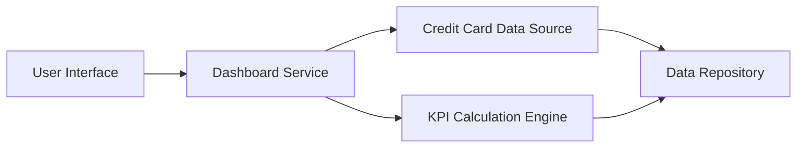

#### 1. High-Level Design

- **Summary**: This epic delivers a consolidated dashboard displaying all user credit cards with key performance indicators including monthly spend, total credit limit, available credit, and outstanding amounts. The dashboard provides real-time monitoring of multiple credit cards with responsive design across desktop, tablet, and mobile devices, enabling better financial decision-making and credit utilization management.

- **Component Flow**:

- **Integration Points**: 
  - **Upstream**: Credit Card Data Source or Mock Data Service (provides card information and transaction data)
  - **Internal**: KPI Calculation Engine (computes monthly spend, available credit, outstanding amounts)
  - **Data Store**: Card and transaction data repository

- **Key Assumptions**: 
  - KPI metrics (available credit, outstanding amount) are calculated in real-time or near-real-time with caching to meet 2-second page load requirement.
  - Credit card data refresh frequency is defined by the upstream data source, with dashboard polling or push notification mechanism for real-time updates.

- **NFR Highlights**: Responsive across desktop, tablet, and mobile devices; page load time under 2 seconds; support real-time data refresh for KPI metrics.

#### 2. Validation Report

- **Requirements Coverage**: The design covers all scope items including dashboard KPIs display, monthly spend tracking, credit limit display, available credit calculation, outstanding amount tracking, multiple cards view, and responsive layout. The architecture separates presentation, business logic (KPI calculation), and data access layers for maintainability and testability.

- **Compliance & Security Considerations**: Credit card information must be handled according to PCI-DSS standards. Sensitive card details (full card numbers, CVV) should not be displayed or stored. Implement role-based access control to ensure users access only their own card data. Session management and timeout policies required for dashboard access.

- **Traceability**: Dashboard KPIs and multi-card view map to UI components. Monthly spend, available credit, and outstanding amount calculations map to KPI Calculation Engine. Responsive design and 2-second load time NFRs are addressed through optimized rendering and caching strategy. Real-time refresh maps to Dashboard Service polling mechanism.