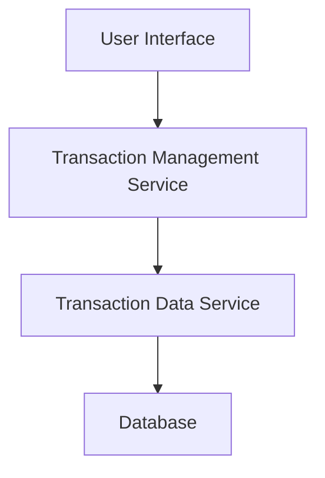

#### 1. High-Level Design

- **Summary**: This epic provides comprehensive transaction viewing and management capabilities allowing users to view, filter, search, and review all credit card transactions across multiple cards. It enables users to access detailed transaction history with up to 10,000 transactions per user, supporting improved spending awareness and financial control.

- **Component Flow**:

- **Integration Points**: 
  - **Upstream**: Transaction Data Service or Repository (retrieves historical transaction records)
  - **Data Store**: Transaction database (stores up to 10,000 transactions per user)

- **Key Assumptions**: 
  - Transactions are stored in a normalized format with indexed fields for filtering and sorting (date, amount, merchant, card ID).
  - Pagination is implemented to handle large transaction sets efficiently while maintaining sub-500ms response times.

- **NFR Highlights**: Must handle up to 10,000 transactions per user; API response time under 500ms; sortable and filterable without performance degradation.

#### 2. Validation Report

- **Requirements Coverage**: The design addresses all scope requirements including transaction list view, transaction details, multi-card aggregation, and filtering/search capabilities. The three-tier architecture (UI, Service, Data) ensures scalability and maintainability. Performance requirements are met through indexed queries and pagination strategy.

- **Compliance & Security Considerations**: Transaction data must be encrypted at rest and in transit. Access control must ensure users can only view their own transactions. Audit logging required for transaction data access. PCI-DSS considerations apply if handling sensitive card data.

- **Traceability**: Transaction list and details views map to UI components. Multi-card aggregation and filtering map to Transaction Management Service. Performance NFRs (500ms response, 10,000 transactions) are addressed through database indexing and query optimization.