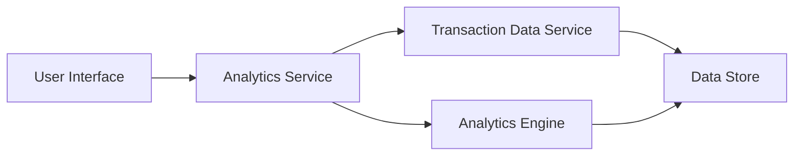

#### 1. High-Level Design

- **Summary**: This epic delivers interactive analytics and visualization capabilities for credit card spending insights. It provides users with monthly spend trends, card-wise spend analysis, and category-wise spending breakdowns across nine predefined categories (Food & Dining, Fuel, Shopping, Travel, Entertainment, Utilities, Healthcare, Education, and Miscellaneous). The solution enables users to identify spending patterns and make informed financial decisions.

- **Component Flow**:

- **Integration Points**: 
  - **Upstream**: Transaction Data Service (provides raw transaction data)
  - **Upstream**: Analytics Engine (performs data aggregation and categorization)
  - **Data Store**: Historical transaction repository (up to 12 months)

- **Key Assumptions**: 
  - Transaction data is pre-categorized by the Analytics Engine into the nine predefined categories, or categorization logic is embedded in the Analytics Service.
  - Monthly aggregation is performed server-side and cached to meet the 1-second rendering requirement.

- **NFR Highlights**: Analytics charts must render within 1 second; support interactive and responsive visualizations; handle data aggregation for up to 12 months of historical data.

#### 2. Validation Report

- **Requirements Coverage**: The design covers all stated scope items including monthly spend trends, card-wise analysis, category-wise breakdowns, and interactive visualizations. The component flow ensures separation of concerns between UI, analytics processing, and data retrieval. Integration with Transaction Data Service and Analytics Engine addresses the stated dependencies.

- **Compliance & Security Considerations**: Standard data privacy controls must be applied to transaction data. User authentication and authorization required for accessing personal spending analytics. Data aggregation should not expose individual transaction details beyond user's own data.

- **Traceability**: All functional requirements (monthly trends, card-wise analysis, category-wise spending) are mapped to the Analytics Service and UI components. NFRs (1-second render time, 12-month historical data) are addressed through caching strategy and data aggregation design.