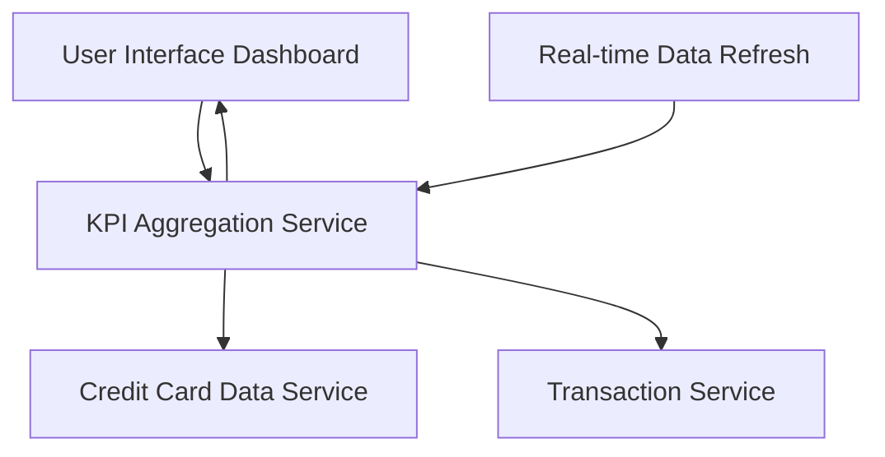

#### 1. High-Level Design

- **Summary**: This epic delivers a consolidated dashboard interface displaying key performance indicators (KPIs) for the user's entire credit card portfolio. The dashboard aggregates and displays critical financial metrics including monthly spend, total credit limit, available credit, and outstanding amounts across all credit cards. The interface is designed to be modern, responsive, and provide real-time visibility into overall credit card financial health.

- **Component Flow**:

- **Integration Points**: 
  - **Upstream**: Credit Card Data Service (retrieves card details, balances, limits, and outstanding amounts)
  - **Upstream**: Transaction Service (calculates monthly spend metrics)
  - **Internal**: Real-time Data Refresh mechanism (ensures KPI metrics are current)

- **Key Assumptions**: 
  - Credit Card Data Service and Transaction Service provide APIs with sub-second response times to meet the 2-second page load requirement
  - KPI calculations (aggregations across multiple cards) are performed server-side by the KPI Aggregation Service

- **NFR Highlights**: Dashboard must be responsive across desktop, tablet, and mobile devices; Page load time must be under 2 seconds; Support real-time data refresh for KPI metrics

#### 2. Validation Report

- **Requirements Coverage**: The design fully addresses the epic's requirements including dashboard interface design, monthly spend display, total credit limit calculation, available credit tracking, outstanding amount display, responsive layout implementation, and multi-card KPI aggregation. The architecture appropriately separates the KPI aggregation logic from data retrieval services (Credit Card Data Service and Transaction Service), enabling efficient data processing. The NFRs for responsiveness across devices, 2-second page load time, and real-time data refresh are clearly specified and must be validated through performance and usability testing. The out-of-scope items (real bank integration, payment processing, fund transfers, loan management) are correctly excluded from the design scope.