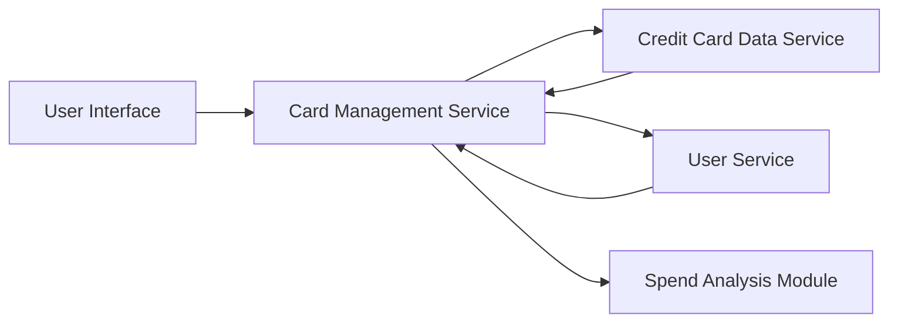

#### 1. High-Level Design

- **Summary**: This epic provides a unified credit card portfolio management interface allowing users to view and manage multiple credit cards (up to 20 per user) within a consolidated dashboard. Users can access individual card details, perform card-wise spend analysis, and visualize card status, limits, and usage patterns. The solution aggregates data from multiple cards to provide a comprehensive portfolio overview.

- **Component Flow**:

- **Integration Points**: 
  - **Upstream**: Credit Card Data Service (provides card information, limits, and status)
  - **Upstream**: User Service (handles user authentication and validates card ownership)
  - **Internal**: Spend Analysis Module (performs card-wise spending calculations)

- **Key Assumptions**: 
  - Credit Card Data Service provides standardized card data format including status, limits, and usage metrics
  - User-to-card ownership mapping is maintained and validated by the User Service

- **NFR Highlights**: System must support at least 20 credit cards per user; Card data retrieval must complete within 500ms; Interface must maintain responsiveness with multiple cards displayed

#### 2. Validation Report

- **Requirements Coverage**: The design comprehensively covers the epic's scope including multiple credit card display, card-wise spend analysis, individual card detail views, card status visualization, credit limit display, and portfolio overview. The architecture properly integrates with the Credit Card Data Service for card information and User Service for authentication and ownership validation. The 500ms data retrieval requirement and support for 20 cards per user are clearly defined NFRs that must be performance-tested. The out-of-scope items (real bank integration, payment processing, card application/activation) are appropriately excluded from the design.