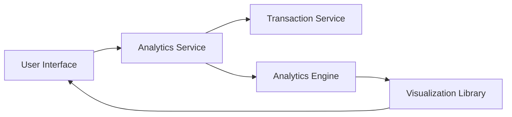

#### 1. High-Level Design

- **Summary**: This epic delivers comprehensive spending analytics capabilities enabling users to visualize and analyze their credit card spending patterns across nine predefined categories (Food & Dining, Fuel, Shopping, Travel, Entertainment, Utilities, Healthcare, Education, and Miscellaneous). The solution provides interactive visualizations including monthly spend trends and category-wise breakdowns to help users understand their spending behavior and identify optimization opportunities.

- **Component Flow**:

- **Integration Points**: 
  - **Upstream**: Transaction Service (provides transaction data and categorization)
  - **Internal**: Analytics Engine (processes and aggregates spending data)
  - **Frontend**: Visualization Library (renders interactive charts and graphs)

- **Key Assumptions**: 
  - Transaction data is pre-categorized by the Transaction Service into the nine spending categories
  - Historical transaction data is readily accessible for trend comparison without additional data migration

- **NFR Highlights**: Analytics visualizations must render within 1 second; System must support analysis of up to 10,000 transactions per user; Charts must be interactive and responsive across all device sizes

#### 2. Validation Report

- **Requirements Coverage**: The design fully addresses the epic's stated scope including monthly spend trend visualization, category-wise spending analysis across nine categories, interactive charts, transaction-based analytics, spending pattern identification, and historical trend comparison. The architecture appropriately separates concerns between data retrieval (Transaction Service), processing (Analytics Engine), and presentation (Visualization Library). The NFRs for performance (1-second render time), scalability (10,000 transactions), and responsiveness are explicitly acknowledged and must be validated during implementation.