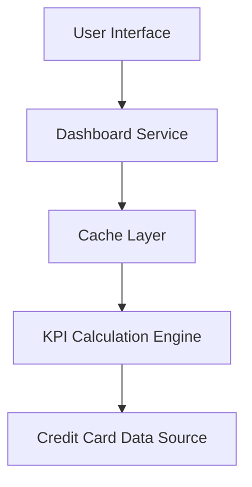

#### 1. High-Level Design

- **Summary:** This epic delivers a consolidated dashboard displaying key performance indicators (monthly spend, total credit limit, available credit, outstanding amounts) for multiple credit cards through a modern, responsive interface, providing users with a comprehensive financial snapshot for better credit management.

- **Component Flow:**

- **Integration Points:** 
  - Upstream: Credit card data sources for retrieving card details, balances, and limits
  - Internal: KPI calculation engine for computing available credit and aggregating multi-card metrics
  - Performance: Cache layer for optimizing dashboard load times

- **Key Assumptions:** 
  - Credit card data sources provide real-time or near real-time balance and limit information
  - Available credit is calculated as (Total Credit Limit - Outstanding Amount) per card

- **NFR Highlights:** System must provide responsive layouts across desktop, tablet, and mobile devices; Dashboard load time must be optimized for quick access to financial data

#### 2. Validation Report

- **Requirements Coverage:** The design addresses all core requirements including dashboard KPIs display, monthly spend tracking, total credit limit view, available credit calculation, outstanding amount display, multiple credit cards view, and responsive layout design. The architecture supports responsive design across devices and optimized load times through caching and efficient KPI calculation.