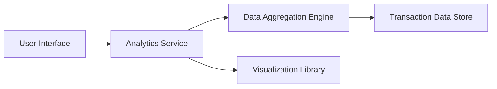

#### 1. High-Level Design

- **Summary:** This epic provides interactive visualizations for analyzing spending patterns across nine categories (Food & Dining, Fuel, Shopping, Travel, Entertainment, Utilities, Healthcare, Education, Miscellaneous), monthly trends, and card-wise analysis to help users understand spending behavior and optimize budgets.

- **Component Flow:**

- **Integration Points:** 
  - Upstream: Transaction data aggregation services for processing raw transaction data
  - Downstream: Visualization libraries (e.g., Chart.js, D3.js) for rendering interactive charts
  - Internal: Data aggregation engine for category classification and trend analysis

- **Key Assumptions:** 
  - Transactions are pre-categorized or can be categorized automatically into the nine defined spending categories
  - Historical data is available for monthly trend analysis

- **NFR Highlights:** Visualizations must render efficiently with responsive design; Analytics must support data aggregation across multiple time periods and categories

#### 2. Validation Report

- **Requirements Coverage:** The design fully covers category-wise spending visualization, monthly spend trends, card-wise spend analysis, and interactive charts across nine spending categories. The architecture supports responsive design and efficient rendering through dedicated visualization components and optimized data aggregation.