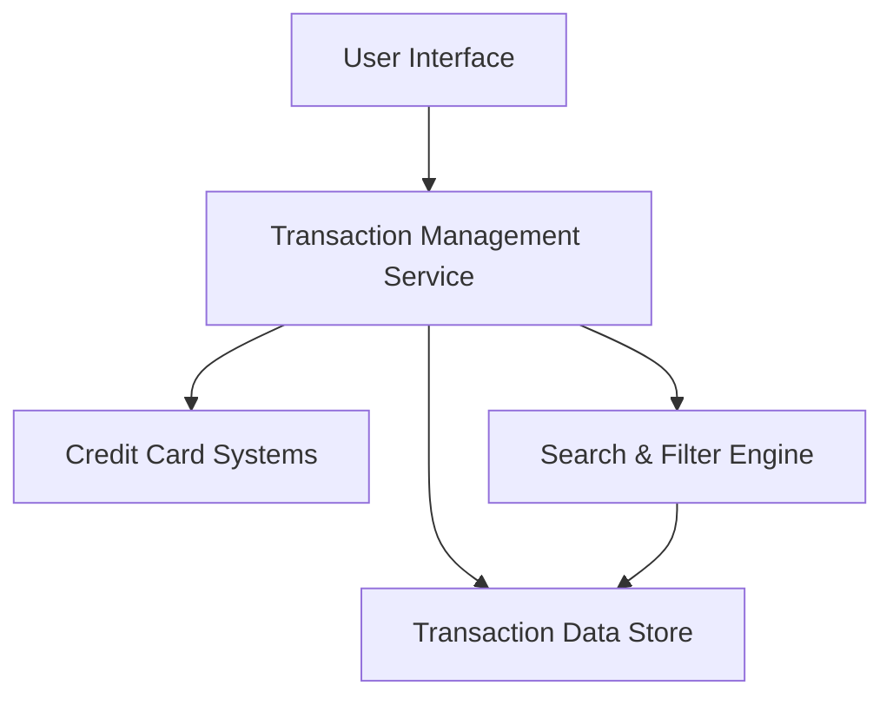

#### 1. High-Level Design

- **Summary:** This epic enables users to view, track, and search all credit card transactions across multiple cards with detailed transaction histories, providing complete visibility into credit card usage for expense tracking and fraud detection.

- **Component Flow:**

- **Integration Points:** 
  - Upstream: Credit card systems for transaction data feeds
  - Downstream: Card management services for transaction retrieval
  - Internal: Transaction data store for persistence and retrieval

- **Key Assumptions:** 
  - Transaction data is provided in a standardized format from credit card systems
  - Transaction updates occur in near real-time or with acceptable refresh intervals

- **NFR Highlights:** Transaction data must be displayed with minimal latency; System must handle large transaction volumes efficiently; Data accuracy and consistency must be maintained

#### 2. Validation Report

- **Requirements Coverage:** The design addresses all stated requirements including transaction listing, history view, multi-card tracking, transaction details display, and search/filter capabilities. The architecture supports the NFRs for latency, volume handling, and data consistency through dedicated service layers and data store optimization.