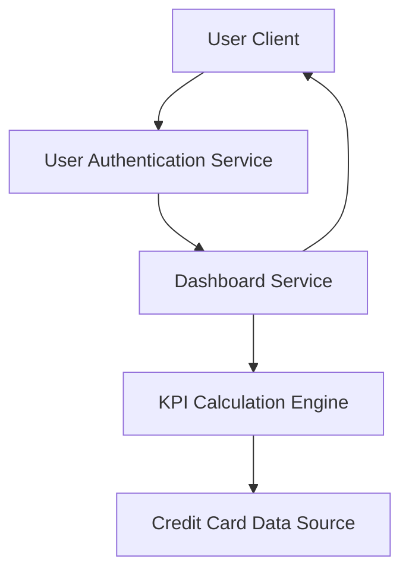

#### 1. High-Level Design

- **Summary**: This epic delivers a consolidated dashboard displaying key performance indicators across all user credit cards. The dashboard shows monthly spend, total credit limit, available credit, and outstanding amounts in a unified view. It supports multiple credit card management with responsive layouts for desktop and mobile devices, providing users with immediate visibility into their credit card portfolio and utilization.

- **Component Flow**:

- **Integration Points**: 
  - **Upstream**: Credit card data sources (provides card details, balances, and transaction data)
  - **Upstream**: User authentication service (ensures secure access to financial data)

- **Key Assumptions**: 
  - Credit card data sources provide near real-time balance and transaction updates
  - KPI calculations aggregate data from multiple cards synchronously during dashboard load

- **NFR Highlights**: Dashboard must load within 2 seconds; system must support responsive layouts across desktop and mobile devices; data refresh rate should be near real-time for accurate financial tracking

#### 2. Validation Report

- **Requirements Coverage**: The design fully covers the stated requirements including dashboard KPIs display, monthly spend tracking, total credit limit aggregation, available credit calculation, outstanding amount tracking, multiple credit card management, and consolidated card view. The architecture supports the 2-second load time requirement through the KPI Calculation Engine and ensures secure access via integration with the User Authentication Service. Responsive layout support is addressed at the User Client layer.