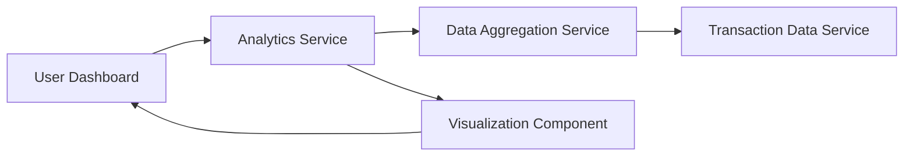

#### 1. High-Level Design

- **Summary**: This epic provides interactive analytics capabilities enabling users to analyze spending patterns through visual representations. Key features include monthly spend trends over time and card-wise spend analysis to identify which cards are used most frequently. The solution supports time-based comparisons and multi-card spending breakdowns to help users make informed financial decisions.

- **Component Flow**:

- **Integration Points**: 
  - **Upstream**: Transaction data service (provides spending information)
  - **Upstream**: Data aggregation service (performs trend calculations and multi-card breakdowns)

- **Key Assumptions**: 
  - Historical transaction data is retained for at least 12 months to support meaningful trend analysis
  - Aggregation calculations are performed server-side to optimize client performance

- **NFR Highlights**: Visualizations must render within 1 second; charts must be interactive and support drill-down capabilities; system must handle historical data for trend analysis

#### 2. Validation Report

- **Requirements Coverage**: The design addresses all requirements including monthly spend trends, card-wise spend analysis, interactive charts, time-based comparisons, and multi-card breakdowns. The architecture separates data aggregation from visualization rendering to meet the 1-second rendering requirement and supports drill-down through the interactive Analytics Service component.