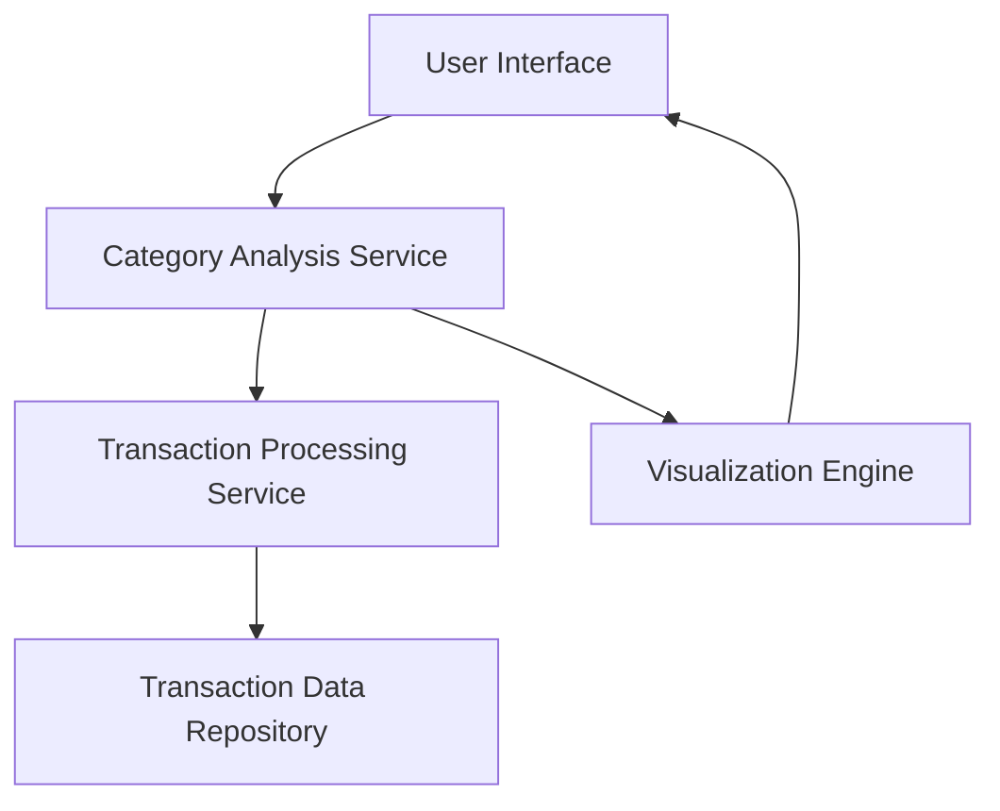

#### 1. High-Level Design

- **Summary**: This epic delivers category-wise spending analysis functionality that organizes credit card transactions into nine predefined categories (Food & Dining, Fuel, Shopping, Travel, Entertainment, Utilities, Healthcare, Education, and Miscellaneous). Users can view interactive visualizations showing spending patterns across categories and drill down into transaction details for each category, supporting cross-card aggregation.

- **Component Flow**:

- **Integration Points**: 
  - **Upstream**: Transaction processing service (provides categorization logic)
  - **Downstream**: Transaction data repository (stores historical transaction records)

- **Key Assumptions**: 
  - Transaction categorization rules are predefined and maintained by the transaction processing service
  - Category assignments are immutable once processed and stored in the repository

- **NFR Highlights**: Category classification must be accurate and consistent; visualization must handle large transaction volumes efficiently

#### 2. Validation Report

- **Requirements Coverage**: The design covers all stated requirements including category-wise visualization, transaction categorization across nine categories, interactive analysis, cross-card aggregation, and transaction listing. The architecture supports filtering and sorting capabilities through the Category Analysis Service and ensures efficient handling of large volumes through the separation of processing and visualization concerns.