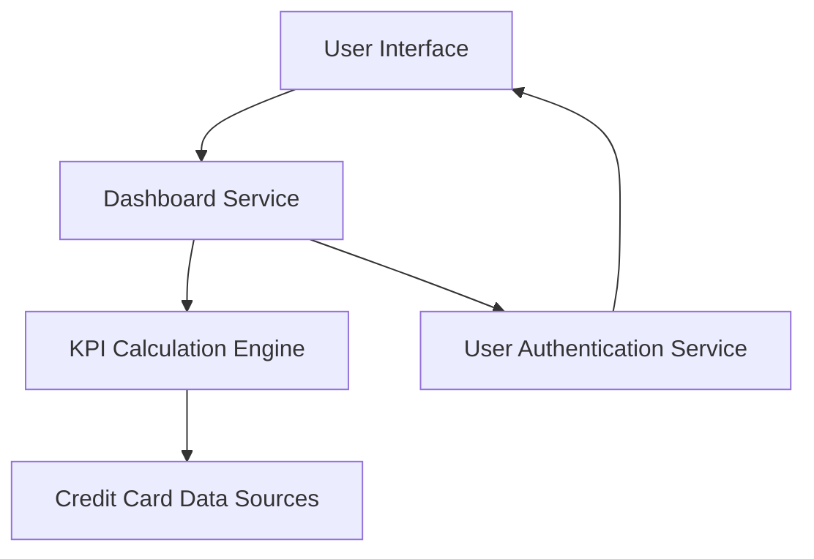

#### 1. High-Level Design

- **Summary**: This epic delivers a consolidated, responsive dashboard that displays critical KPIs for the user's credit card portfolio including monthly spend, total credit limit, available credit, and outstanding amounts. The dashboard provides real-time visibility into financial health and credit utilization across all cards in a modern, responsive interface.

- **Component Flow**:

- **Integration Points**: 
  - Upstream: Credit card data sources (for balance and transaction information)
  - Internal: User authentication service (for multi-user support and data isolation)

- **Key Assumptions**: 
  - Credit card data sources provide APIs or data feeds with near real-time updates
  - Responsive design follows mobile-first principles with breakpoints for tablet and desktop

- **NFR Highlights**: Dashboard must load within 2 seconds; System must support responsive design for mobile, tablet, and desktop viewports; Data refresh rate should be near real-time

#### 2. Validation Report

- **Requirements Coverage**: The design fully covers the epic's requirements including monthly spend display, total credit limit calculation, available credit tracking, outstanding amount monitoring, responsive dashboard layout, and KPI widgets. The architecture supports all specified NFRs including 2-second load time, responsive design across multiple viewports, and near real-time data refresh. Dependencies on credit card data sources and user authentication service are incorporated into the component flow.