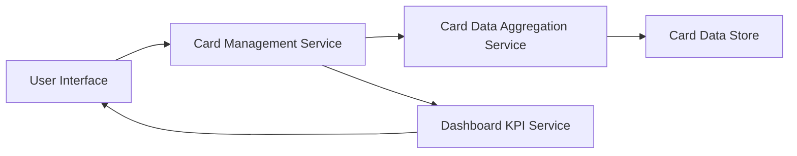

#### 1. High-Level Design

- **Summary**: This epic provides a unified interface for users to manage and visualize multiple credit cards simultaneously. Users can view individual card details, track card-specific spending, perform card-wise spend analysis, and compare performance across their entire credit card portfolio to optimize card usage.

- **Component Flow**:

- **Integration Points**: 
  - Upstream: Credit card data aggregation service (card details and balances)
  - Internal: Dashboard KPI system (for consolidated metrics across all cards)

- **Key Assumptions**: 
  - Card data is synchronized periodically from external sources with sufficient frequency for user needs
  - User authentication and authorization are handled by a separate service layer

- **NFR Highlights**: System must support management of up to 20 credit cards per user; Card data retrieval must complete within 1 second; Interface must maintain performance with concurrent user access

#### 2. Validation Report

- **Requirements Coverage**: The design addresses all core requirements including multiple credit card display, card-wise spend analysis, individual card details view, card selection and filtering, and card comparison capabilities. The architecture supports the NFRs for scale (20 cards per user), performance (1-second retrieval), and concurrency. Integration points with the card data aggregation service and dashboard KPI system are clearly defined in the component flow.