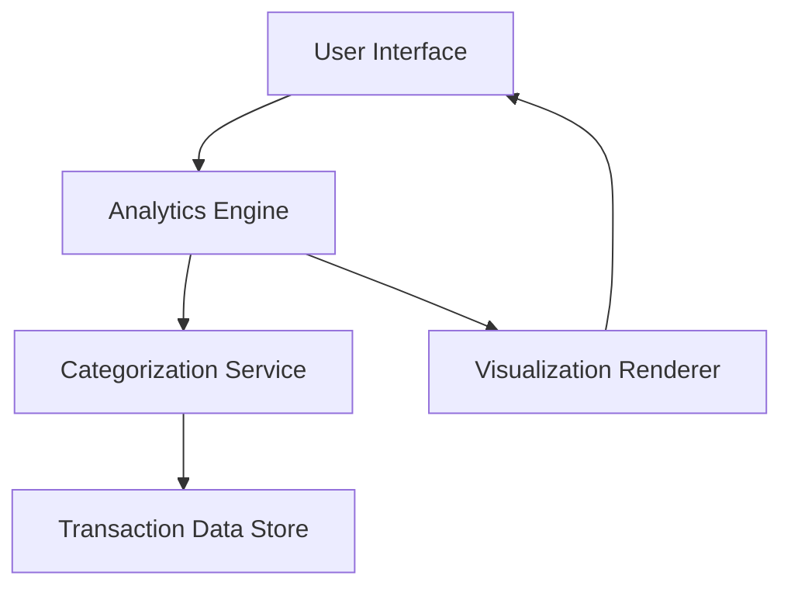

#### 1. High-Level Design

- **Summary**: This epic delivers comprehensive transaction analytics capabilities enabling users to visualize monthly spending trends and analyze spending patterns across nine predefined categories (Food & Dining, Fuel, Shopping, Travel, Entertainment, Utilities, Healthcare, Education, and Miscellaneous). The system provides interactive visualizations and actionable insights to help users understand their spending behavior.

- **Component Flow**:

- **Integration Points**: 
  - Upstream: Credit card systems (transaction data feed)
  - Internal: Dashboard service (for summary metrics integration)
  - Internal: Categorization engine (for automatic transaction classification)

- **Key Assumptions**: 
  - Transaction data arrives in a standardized format from credit card systems
  - Categorization rules are predefined and maintained separately from the analytics engine

- **NFR Highlights**: Analytics engine must process and categorize transactions within 3 seconds; Visualizations must render smoothly with up to 10,000 transactions; System must support real-time filtering and drill-down capabilities

#### 2. Validation Report

- **Requirements Coverage**: The design covers all stated requirements including monthly spend trends visualization, category-wise spending analysis across nine categories, interactive charts and graphs, transaction categorization, and spending pattern identification. The architecture supports the specified NFRs for performance (3-second processing) and scale (10,000 transactions). All identified dependencies (transaction data feed, categorization engine, dashboard integration) are accounted for in the component flow.