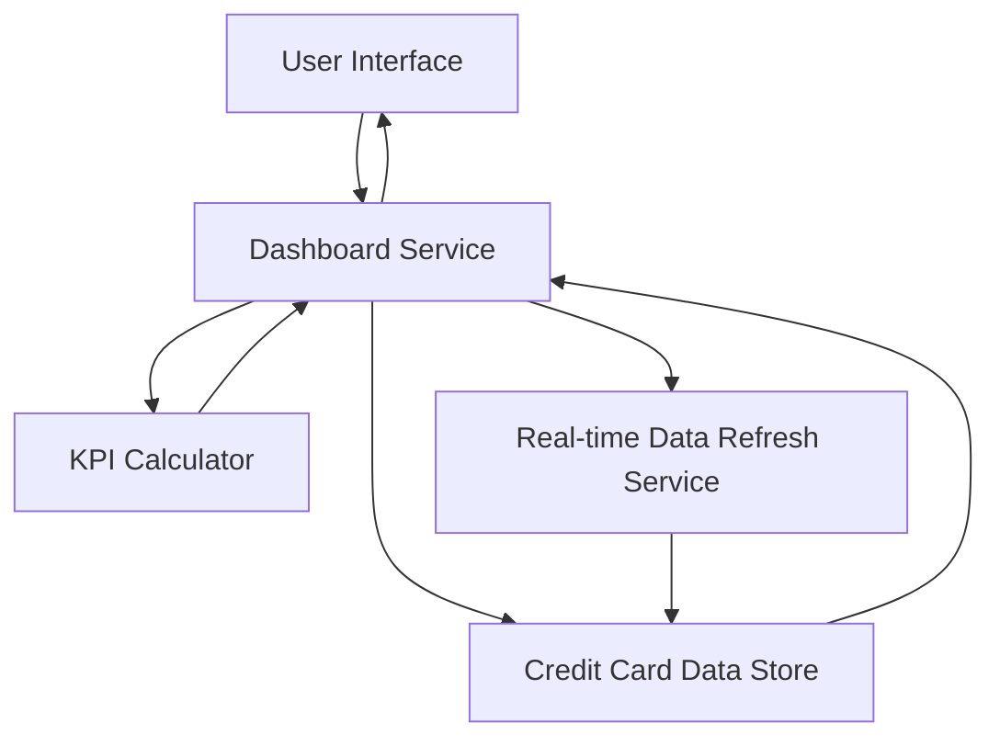

#### 1. High-Level Design

- **Summary**: This epic delivers a consolidated dashboard for managing multiple credit cards with real-time KPI monitoring. Users can view monthly spend, total credit limit, available credit, and outstanding amounts across their entire credit card portfolio from a single responsive interface, enabling proactive credit management and financial decision-making.

- **Component Flow**:

- **Integration Points**: 
  - Upstream: Credit card data source or mock data service (provides card details, balances, limits, and outstanding amounts)
  - Internal: Transaction aggregation service for monthly spend calculation
  - Downstream: Analytics and Transaction modules (consume card portfolio data)

- **Key Assumptions**: 
  - Credit card data source provides real-time or near-real-time balance and limit information
  - KPI calculations aggregate data across all cards using consistent business rules

- **NFR Highlights**: Dashboard must load within 2 seconds; system must support real-time data refresh; responsive design must support desktop and mobile viewports; data must be displayed accurately with no calculation errors

#### 2. Validation Report

- **Requirements Coverage**: The design covers all stated scope items including dashboard KPIs display (monthly spend, total credit limit, available credit, outstanding amount), multiple credit card management, and responsive dashboard layout. The architecture supports the NFR requirements for 2-second load time, real-time data refresh, responsive design for multiple viewports, and calculation accuracy. The dependency on credit card data source is identified and accommodated in the component flow.