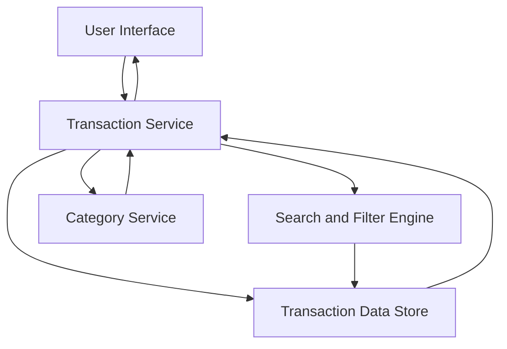

#### 1. High-Level Design

- **Summary**: This epic provides comprehensive transaction viewing and management capabilities across multiple credit cards. Users can access detailed transaction history, search and filter transactions by various criteria, and view complete transaction details including merchant name, amount, date, and category. This serves as the data foundation for spending analysis.

- **Component Flow**:

- **Integration Points**: 
  - Upstream: Transaction data source or mock transaction service (provides raw transaction data)
  - Internal: Credit card data service for card-wise transaction filtering
  - Downstream: Analytics module (consumes transaction data for spending analysis)

- **Key Assumptions**: 
  - Transaction data source provides standardized transaction records with merchant, amount, date, and category fields
  - Multi-card transaction aggregation assumes consistent data schema across all cards

- **NFR Highlights**: Transaction queries must return results within 1 second; system must handle transaction history for multiple cards efficiently; data integrity must be maintained for all transaction records

#### 2. Validation Report

- **Requirements Coverage**: The design covers all stated scope items including transaction listing, transaction details view, multi-card transaction aggregation, search and filtering capabilities, and transaction categorization. The architecture supports the NFR requirements for 1-second query response time, efficient multi-card handling, and data integrity. Dependencies on transaction data source and credit card data service are identified and integrated into the component flow.