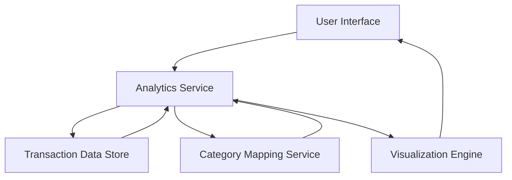

#### 1. High-Level Design

- **Summary**: This epic delivers interactive visualizations and analytical capabilities for credit card spending analysis. It enables users to view monthly spend trends, category-wise spending breakdowns across 9 predefined categories (Food & Dining, Fuel, Shopping, Travel, Entertainment, Utilities, Healthcare, Education, Miscellaneous), and card-wise spend analysis to support informed financial planning.

- **Component Flow**:

- **Integration Points**: 
  - Upstream: Transaction Management module (provides transaction data)
  - Internal: Category mapping service/logic for transaction categorization
  - Downstream: Visualization rendering components

- **Key Assumptions**: 
  - Transaction data includes sufficient metadata for category mapping (merchant type, MCC codes, or similar)
  - Historical transaction data is retained for at least 12 months in the data store

- **NFR Highlights**: Visualizations must render within 3 seconds; charts must be interactive and responsive; system must support 12 months of historical data analysis; analytics calculations must be accurate and consistent

#### 2. Validation Report

- **Requirements Coverage**: The design covers all stated scope items including monthly spend trends visualization, category-wise spending analysis across all 9 specified categories, card-wise spend analysis, and interactive charts. The architecture supports the NFR requirements for 3-second rendering, interactivity, 12-month historical analysis, and calculation accuracy. Dependencies on Transaction Management module and category mapping are identified and accommodated in the component flow.