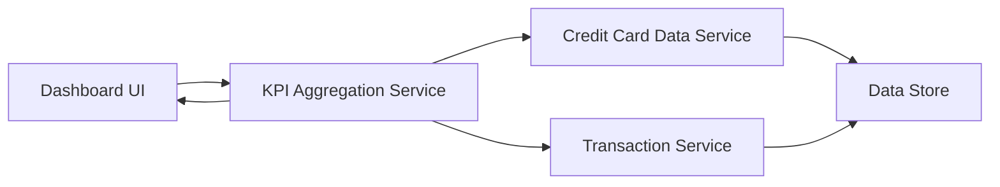

#### 1. High-Level Design

- **Summary**: This epic delivers a consolidated financial dashboard that aggregates and displays critical KPIs across all user credit cards. The dashboard presents four key metrics: Monthly Spend (total spending across all cards), Total Credit Limit (aggregate credit limit), Available Credit (remaining credit capacity), and Outstanding Amount (total balance due). The interface provides a comprehensive financial health snapshot enabling quick assessment and informed decision-making.

- **Component Flow**:

- **Integration Points**: 
  - **Data Sources**: Credit Card Data Service (provides card details, balances, and credit limits)
  - **Transaction Data**: Transaction Service (calculates monthly spend totals)
  - **Frontend**: Responsive dashboard layout supporting mobile, tablet, and desktop viewports

- **Key Assumptions**: 
  - KPI calculations are performed server-side with caching mechanisms to meet the 2-second load time requirement
  - Outstanding amounts are calculated as the sum of current balances across all cards without interest projections

- **NFR Highlights**: Dashboard must load within 2 seconds; Must support responsive design for mobile, tablet, and desktop viewports; System must handle real-time calculation of aggregated metrics across multiple cards

#### 2. Validation Report

- **Requirements Coverage**: The design comprehensively covers all scope elements including Monthly Spend KPI display, Total Credit Limit aggregation, Available Credit calculation and display, Outstanding Amount tracking, consolidated multi-card view, and responsive dashboard layout. The architecture supports the stated NFRs for performance (2-second load time), responsive design across all device types, and real-time metric aggregation. Dependencies on Credit Card Data Service and Transaction Service are properly integrated into the component flow with clear data flow paths.