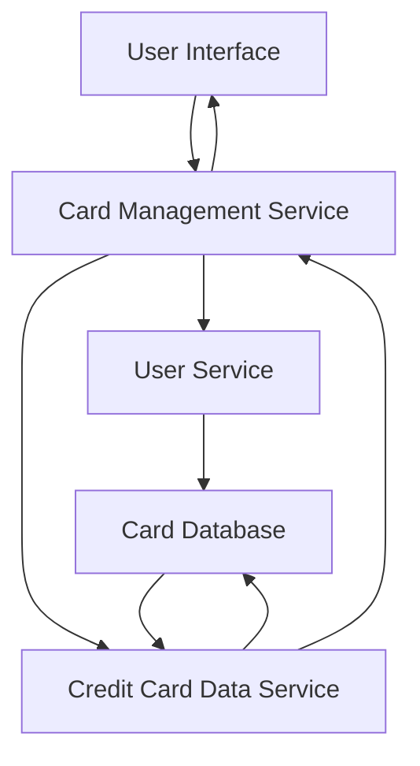

#### 1. High-Level Design

- **Summary**: This epic provides a unified interface for users to manage and monitor multiple credit cards from a single dashboard. Users can view all registered cards with individual card details, track card-specific metrics (credit limits, balances, spending), and perform card-wise analysis. The system consolidates credit card portfolio information, eliminating the need to access multiple banking platforms.

- **Component Flow**:

- **Integration Points**: 
  - **Upstream**: User Service (handles user authentication and card ownership validation)
  - **Data Layer**: Credit Card Data Service (stores and retrieves card information, balances, and limits)

- **Key Assumptions**: 
  - Card data is stored in a normalized database structure with user-to-card relationships managed through foreign keys
  - Card refresh operations are triggered on-demand by user actions or scheduled background jobs

- **NFR Highlights**: System must support minimum 10 credit cards per user; Card data refresh must complete within 3 seconds; Interface must maintain performance with multiple cards loaded simultaneously

#### 2. Validation Report

- **Requirements Coverage**: The design addresses all scope requirements including displaying multiple credit cards, card-wise spend analysis, individual card details view, card-specific credit limit and balance tracking, and card selection/filtering capabilities. The architecture accommodates the NFRs for scalability (10+ cards per user), performance (3-second refresh), and concurrent card loading. Dependencies on User Service and Credit Card Data Service are properly integrated into the component flow.