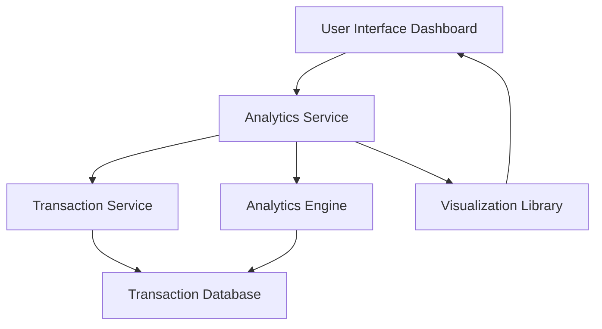

#### 1. High-Level Design

- **Summary**: This epic delivers interactive spending analytics capabilities that enable users to visualize and analyze their credit card spending patterns across time periods and expense categories. The system provides monthly trend analysis and category-wise spending breakdowns across nine predefined categories (Food & Dining, Fuel, Shopping, Travel, Entertainment, Utilities, Healthcare, Education, and Miscellaneous), empowering users to make data-driven financial decisions.

- **Component Flow**:

- **Integration Points**: 
  - **Upstream**: Transaction Service (provides transaction data and categorization)
  - **Internal**: Analytics Engine (processes and aggregates spending data)
  - **Frontend**: Visualization Library (renders interactive charts and graphs)

- **Key Assumptions**: 
  - Transaction categorization is performed by the Transaction Service with pre-trained classification logic
  - Historical data retention is managed at the database level with 12+ months of transaction history available

- **NFR Highlights**: Analytics visualizations must render within 1.5 seconds; System must support 12 months historical data analysis; Transaction categorization accuracy must be 95%+; Charts must support interactive drill-down capabilities

#### 2. Validation Report

- **Requirements Coverage**: The design fully covers the epic's scope including monthly spend trend visualization, category-wise spending analysis across all nine predefined categories, interactive charts with drill-down capabilities, transaction history view, and time-based filtering. The architecture supports the stated NFRs for performance (1.5s render time), data retention (12 months), and categorization accuracy (95%). All identified dependencies (Transaction Service, Analytics Engine, Visualization Library) are incorporated into the component flow.