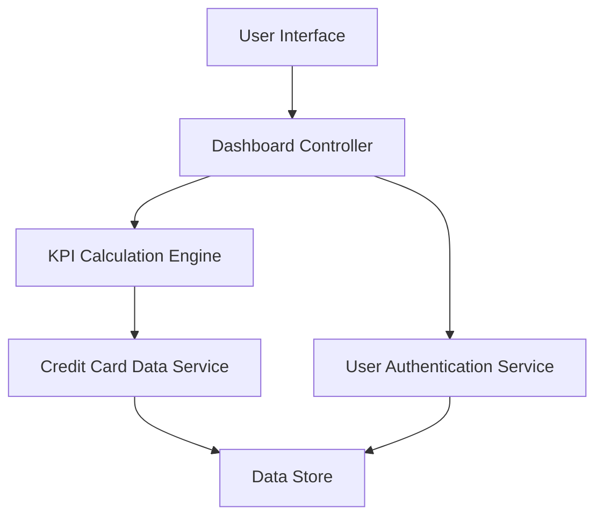

#### 1. High-Level Design

- **Summary**: This epic delivers a consolidated dashboard displaying critical KPIs for credit card financial health: monthly spend, total credit limit, available credit, and outstanding amount. The dashboard aggregates data across all user credit cards in a responsive layout supporting desktop, tablet, and mobile devices.

- **Component Flow**:

- **Integration Points**: 
  - **Upstream**: Credit card data service for retrieving card balances, limits, and transaction data
  - **Upstream**: User authentication service for secure access control

- **Key Assumptions**: 
  - Available credit is calculated as (Total Credit Limit - Outstanding Amount) aggregated across all cards
  - Real-time data refresh is implemented via polling mechanism with configurable intervals

- **NFR Highlights**: Dashboard must be responsive across desktop, tablet, and mobile devices; KPI data must load within 2 seconds; System must support real-time data refresh

#### 2. Validation Report

- **Requirements Coverage**: The design fully covers the epic's requirements including monthly spend display, total credit limit tracking, available credit calculation, outstanding amount monitoring, consolidated multi-card view, and responsive dashboard layout. The architecture satisfies all NFR requirements for responsive design, performance (2-second load time), and real-time data refresh capability. Dependencies on credit card data service and user authentication service are properly addressed in the component flow.