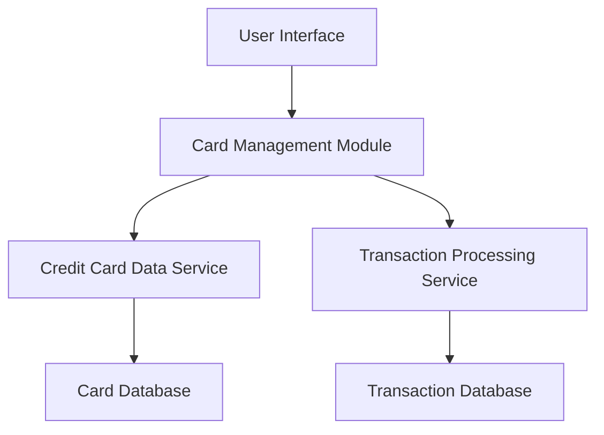

#### 1. High-Level Design

- **Summary**: This epic provides a centralized interface for users to view and manage up to 20 credit cards simultaneously. It enables monitoring of individual card details, card-specific spending tracking, and card-wise spend analysis to optimize card usage and prevent credit limit violations.

- **Component Flow**:

- **Integration Points**: 
  - **Upstream**: Credit card data service for card information retrieval
  - **Upstream**: Transaction processing service for card-specific transaction data

- **Key Assumptions**: 
  - Card data synchronization is triggered on user login or manual refresh action
  - Card selection and filtering operates on client-side after initial data load for performance

- **NFR Highlights**: System must support up to 20 credit cards per user; Card data synchronization must occur within 3 seconds; Interface must maintain performance with large transaction histories

#### 2. Validation Report

- **Requirements Coverage**: The design addresses all core requirements including multiple credit card display, card-wise spend analysis, individual card details view, card selection and filtering, and monthly spend trends per card. The architecture supports the NFR constraints for scalability (20 cards per user), performance (3-second sync), and handling large transaction histories. Dependencies on credit card data service and transaction processing service are properly integrated.