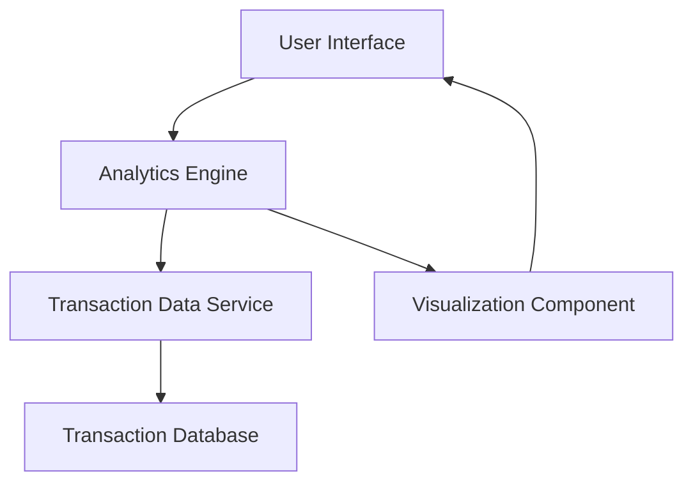

#### 1. High-Level Design

- **Summary**: This epic delivers interactive analytics and visualizations enabling users to understand spending patterns across 9 transaction categories (Food & Dining, Fuel, Shopping, Travel, Entertainment, Utilities, Healthcare, Education, Miscellaneous). It includes monthly spend trends, category-wise breakdowns, and transaction history views to support data-driven financial decisions.

- **Component Flow**:

- **Integration Points**: 
  - **Upstream**: Transaction data service for retrieving and categorizing transaction records
  - **Downstream**: Analytics engine for processing spending patterns and trends

- **Key Assumptions**: 
  - Transaction categorization is performed automatically by the transaction data service with predefined rules
  - Monthly spend trends are calculated based on transaction date fields in standard format

- **NFR Highlights**: Analytics visualizations must render within 1.5 seconds; System must handle up to 10,000 transactions per user; Charts must be responsive across all device sizes

#### 2. Validation Report

- **Requirements Coverage**: The design covers all stated requirements including category-wise spending visualization across 9 categories, monthly spend trends, interactive charts, transaction categorization, spending pattern analysis, and transaction history view. The architecture supports the NFR requirements for performance (1.5s render time), scalability (10,000 transactions), and responsive design. Integration with transaction data service and analytics engine addresses the stated dependencies.