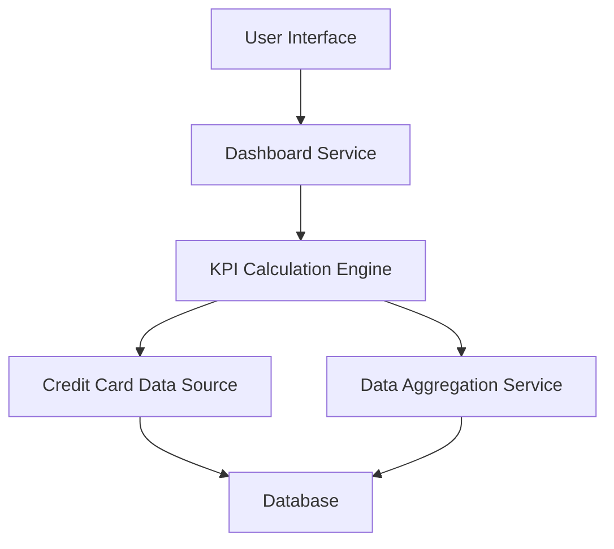

#### 1. High-Level Design

- **Summary**: This epic delivers a consolidated dashboard displaying key performance indicators (KPIs) for the user's credit card portfolio. The dashboard provides real-time visibility into monthly spend, total credit limit, available credit, and outstanding amount through a modern, responsive interface. This enables users to make informed decisions about credit card usage and maintain financial health.

- **Component Flow**:

- **Integration Points**: 
  - **Upstream**: Credit Card Data Source (provides card balances, limits, and transaction data)
  - **Upstream**: Data Aggregation Service (consolidates data from multiple sources for unified KPI views)

- **Key Assumptions**: 
  - Credit card data source provides near real-time updates for balances and transactions
  - KPI calculations (available credit, outstanding amount) follow standard formulas: Available Credit = Total Credit Limit - Outstanding Amount

- **NFR Highlights**: Dashboard must be responsive across desktop, tablet, and mobile devices; KPI data refresh must occur in real-time or near real-time; System must support concurrent access by multiple users

#### 2. Validation Report

- **Requirements Coverage**: The design fully covers the stated scope including monthly spend display, total credit limit tracking, available credit calculation, outstanding amount monitoring, responsive dashboard layout, and consolidated KPI view. The architecture supports all NFR requirements for responsive design across devices, real-time/near real-time data refresh, and concurrent user access. Integration dependencies with credit card data source and data aggregation service are clearly defined and align with the epic's stated dependencies.