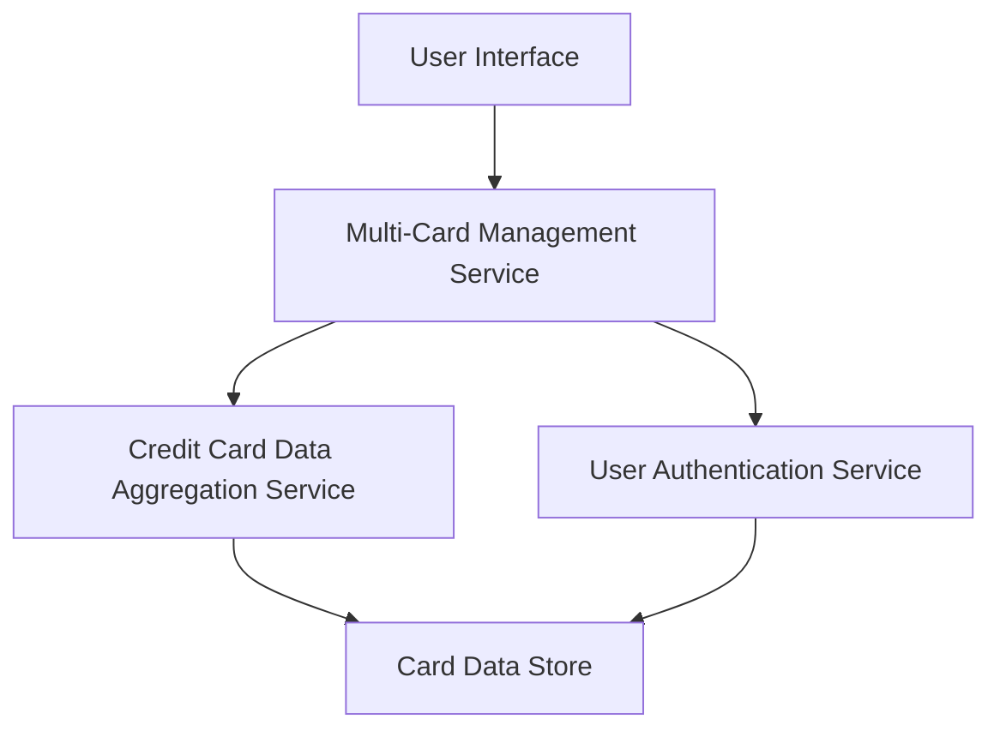

#### 1. High-Level Design

- **Summary**: This epic provides a unified interface for users to manage and monitor multiple credit cards (up to 10 per user) from a single dashboard. Users can view all credit cards, access card-specific details, perform card-wise spend analysis, and track individual card performance. The solution eliminates the need to switch between different banking apps by consolidating all credit card information in one place.

- **Component Flow**:

- **Integration Points**: 
  - **Upstream**: Credit Card Data Aggregation Service (retrieves information from multiple card sources)
  - **Upstream**: User Authentication Service (provides secure access control to card information)

- **Key Assumptions**: 
  - Card data aggregation service provides a standardized data format across different card sources
  - User authentication is handled by an existing service with sufficient security controls for financial data access

- **NFR Highlights**: System must support display and management of at least 10 credit cards per user; Card data loading must complete within 2 seconds; Interface must maintain usability with increasing number of cards

#### 2. Validation Report

- **Requirements Coverage**: The design addresses all core requirements including multiple credit card display, card-wise spend analysis, card details view, card selection/filtering, and individual card performance tracking. The architecture supports the NFR requirements for handling 10+ cards per user, 2-second data loading, and scalable usability. Integration dependencies with credit card data aggregation and authentication services are properly identified and mapped to the component flow.